## 1. 初识JavaScript

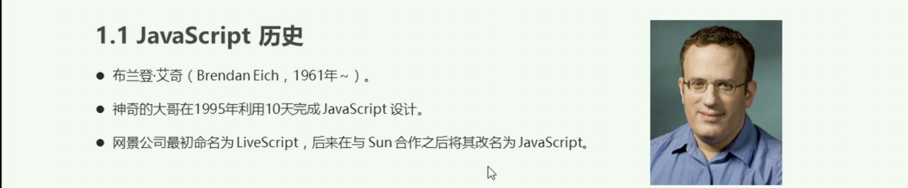

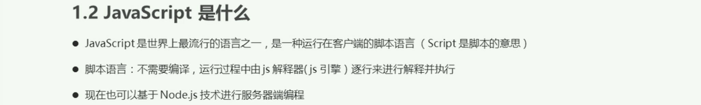

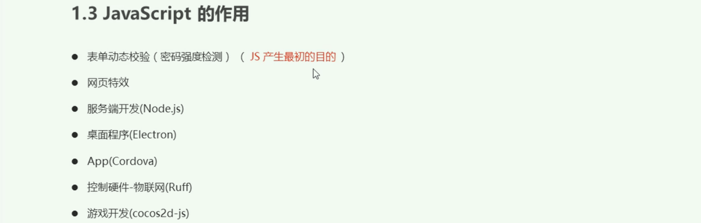

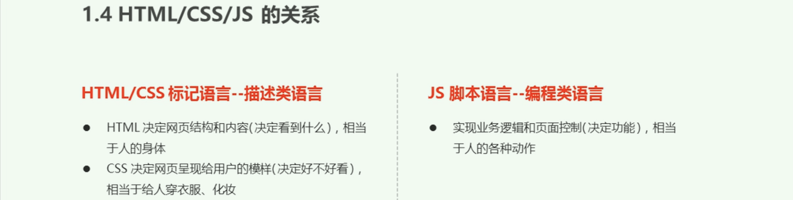

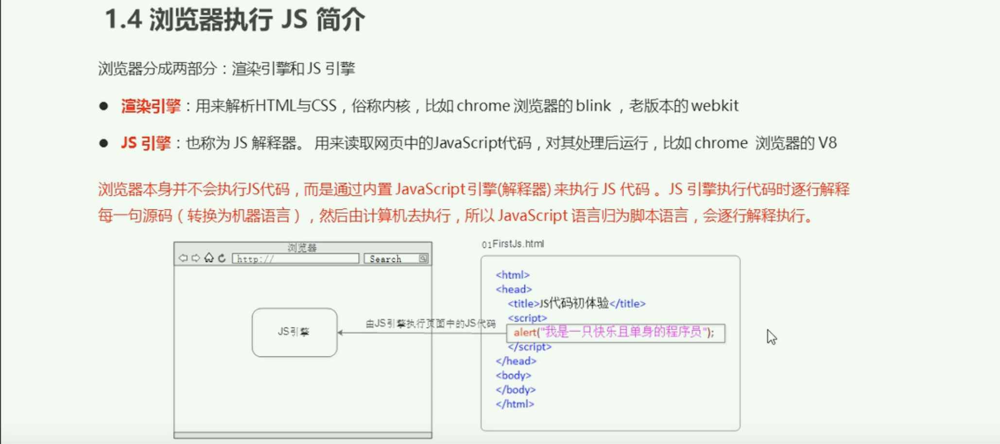

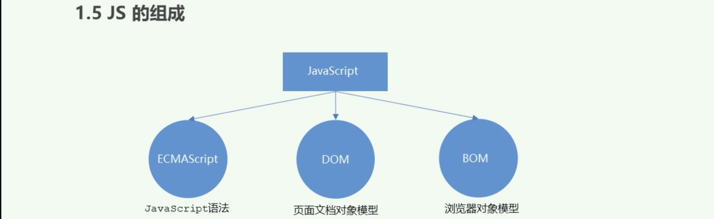

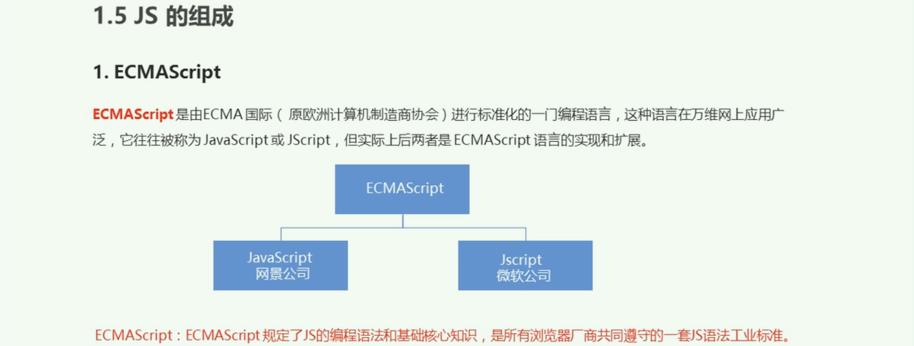

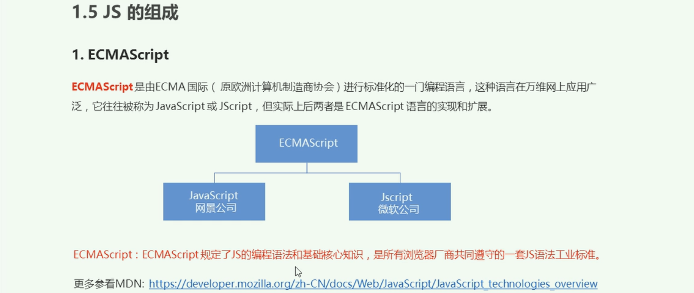

- https://developer.mozilla.org/zh-CN/docs/Web/JavaScript/JavaScript_technologies_overview

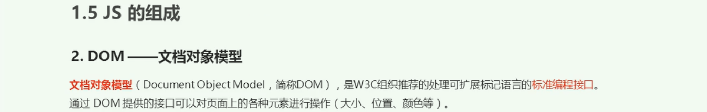

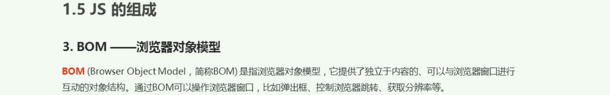

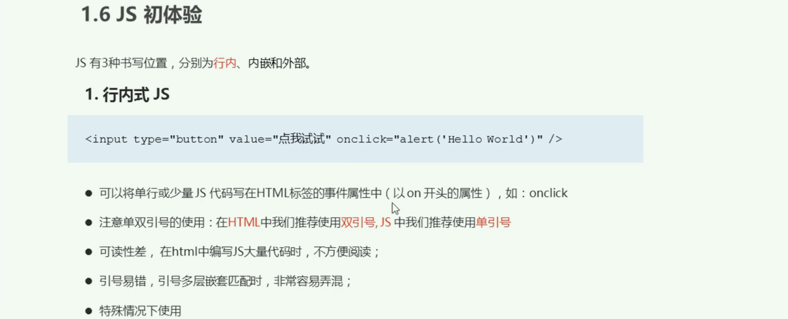

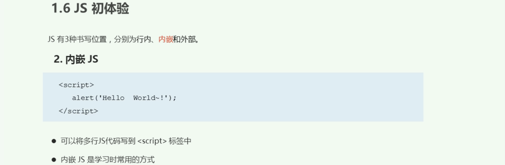

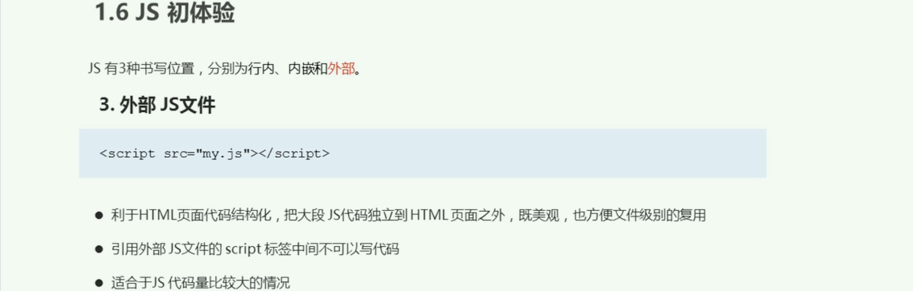

## 2. 注释

```
单行注释
//
多行注释
/*
*/
```

## 3. JavaScirpt输入输出语句

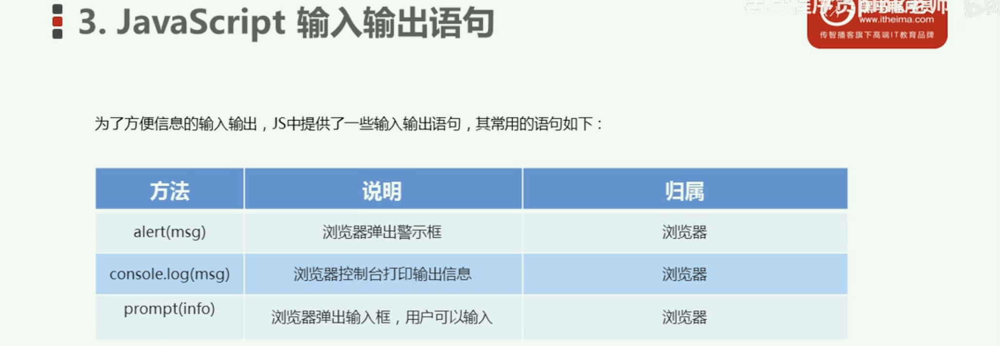