## JS流程控制 - 分支

### 1. 流程控制


### 2. 顺序流程控制

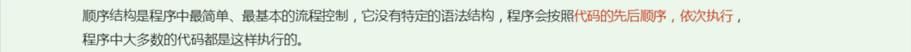

### 3. 分支语句

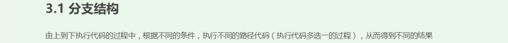

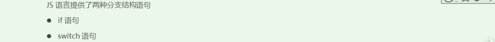

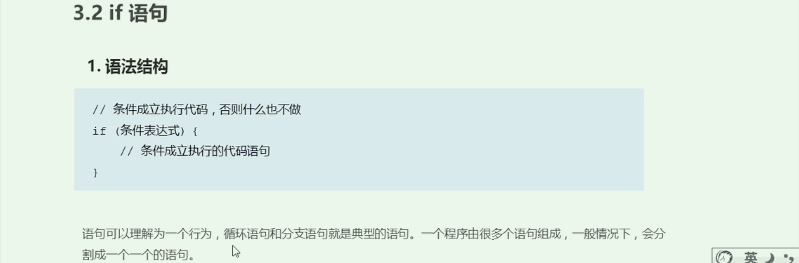

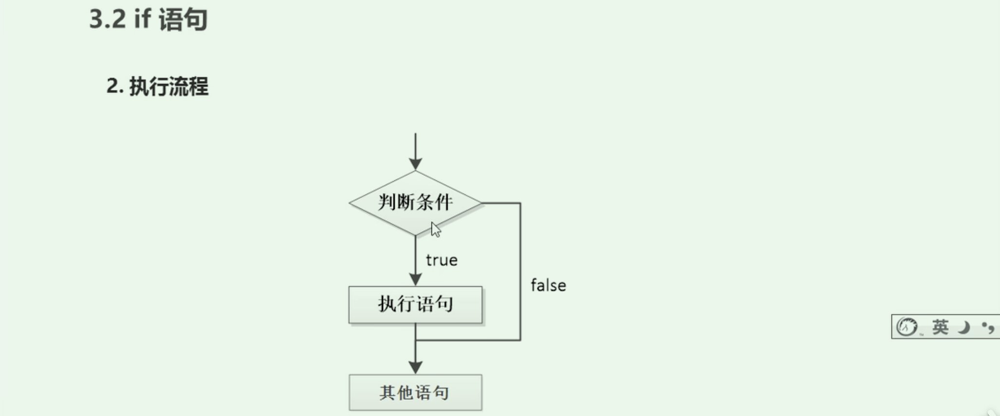

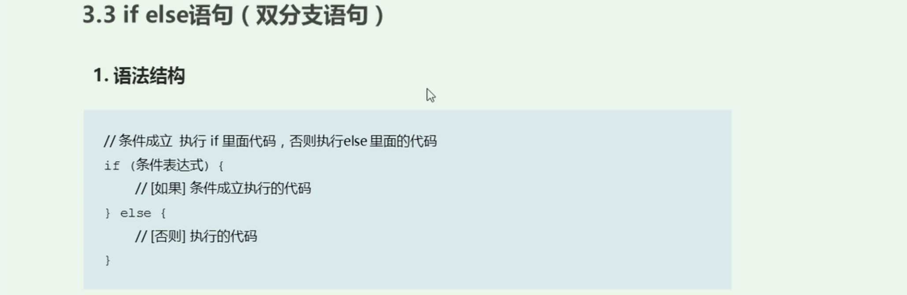

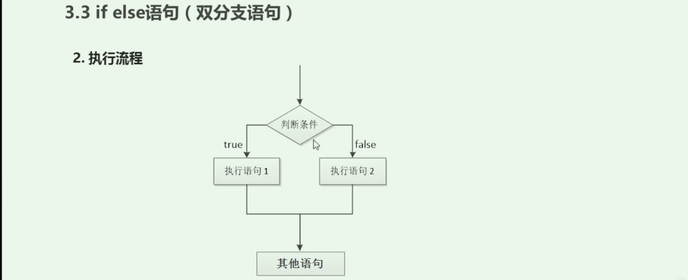

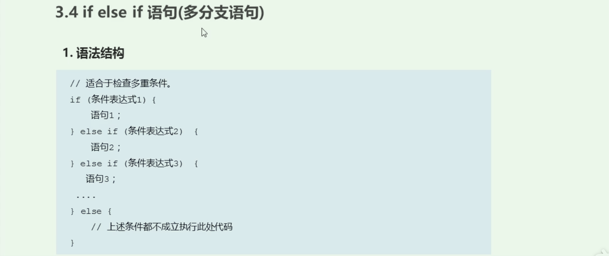

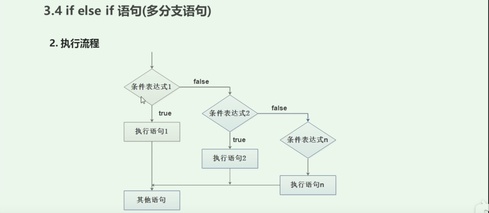

### 4. 三元表达式

```
A ? B : C 
// A成立返回B，否则返回C
```

### 5. 分支流程控制Switch语句

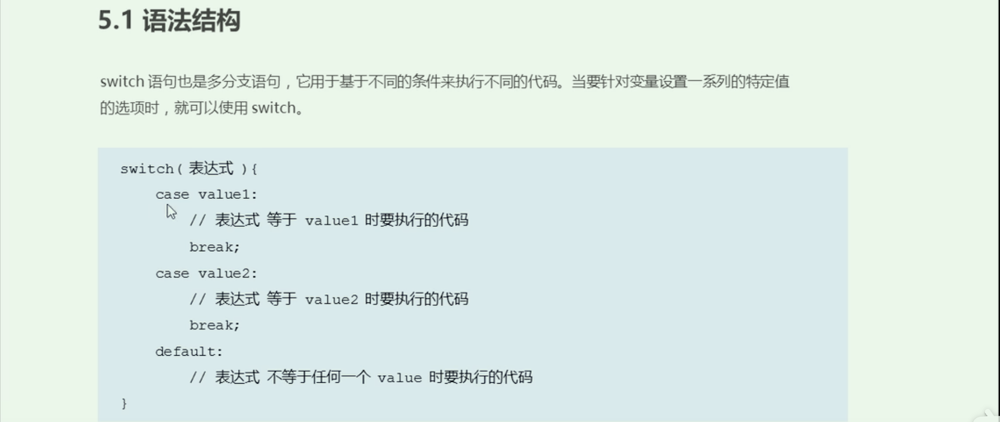

- switch中的表达式和value是全等才能匹配（===），值和类型都一样

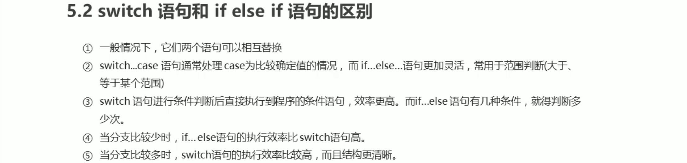

## JS流程控制 - 循环

### 1. 循环


 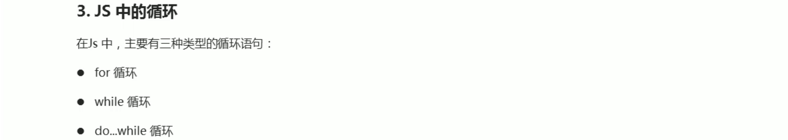

### 2. for循环

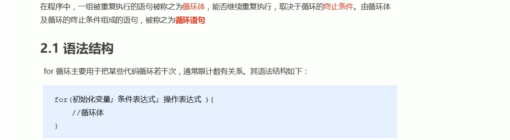


### 4. while循环

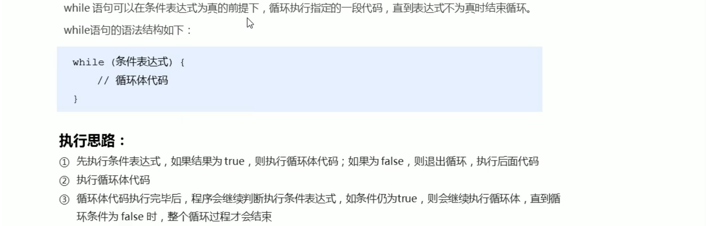

### 5. do while循环


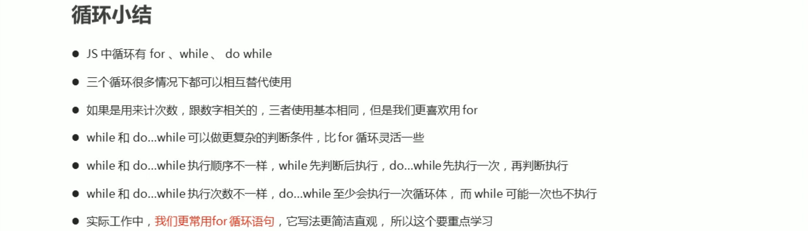

### 6. continue break

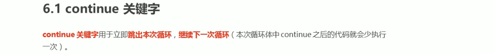

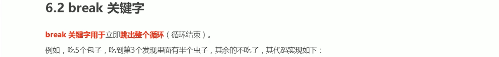