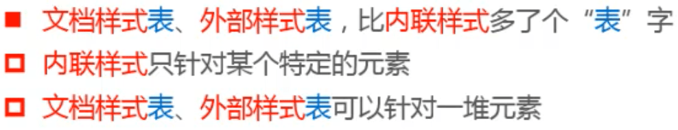

## CSS

- 什么是CSS
  - CSS的作用是：可以给网页中的每一个元素设置样式（“化妆”、 排版布局） ，让网页更加精美
  - 完全没有使用CSS的网页：基本就是一堆从上到下、从左到右挨在一起的文字和图片
  - CSS的全称是Cascading Style Sheets，层叠样式表

### CSS样式的书写格式

### 如何将CSS样式应用到元素上？

#### 内联样式（inline style）

#### 文档样式表（document style sheet）

#### 外部样式表（external style sheet）

##### @charset

##### @import

#### 小细节

#### 等价写法

### 注释

**否则样式会失效**

### HTML和CSS的编写准则

**注：**标签属性宽高不带带单位，css宽高必须带单位

### 设置网页图标

### 简史

### 常用CSS属性

### CSS官方文档

- 官方文档地址
  - https://www.w3.org/standards/techs/css
  - https://www.w3.org/TR/CSS22/
  - https://www.w3.orq/TR/CSS22/propidx.html
- CSS代码合法检测
  - http://jigsaw.w3.org/css-validator/
  - https://caniuse.com

### 最常用的CSS属性

- background-color决定背景色
- color属性用来设置文本内容的前景色
  - 包括文字、装饰线、边框、外轮廓等的颜色

### 练习

通过span设置不同字体样式

### CSS属性的可用性

## 颜色

### RGB颜色

 

 

### RGBA颜色

### 找出BUG在哪？

- 必须使用英文符号，中文分号语法错误，设置无效

