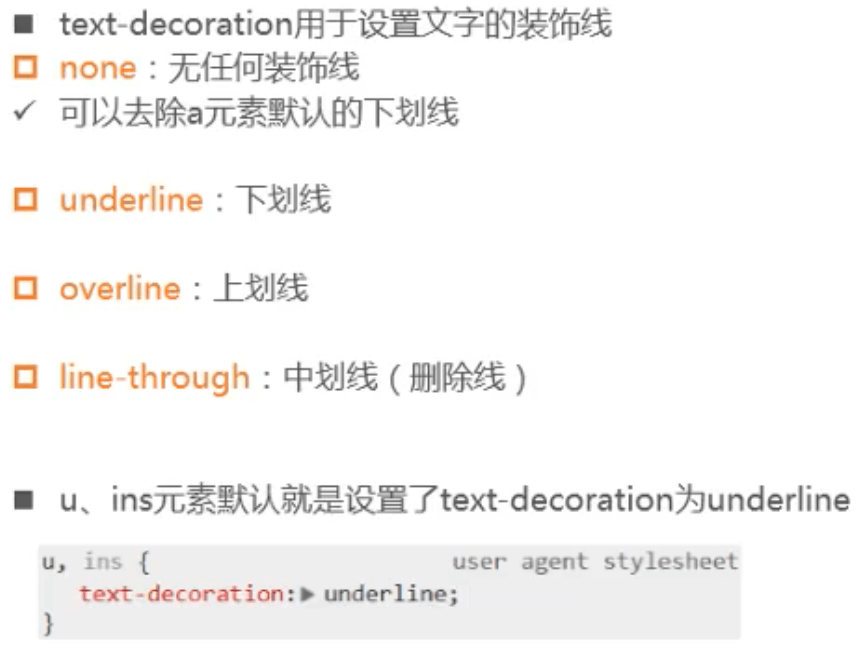
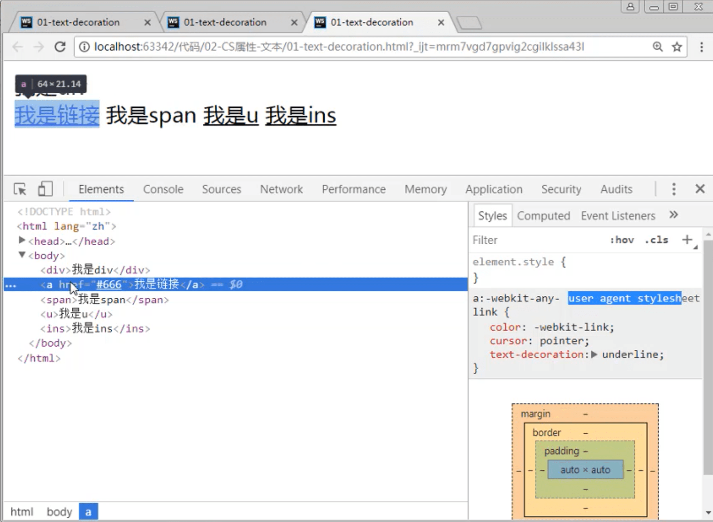
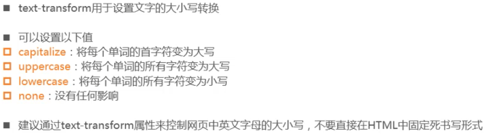
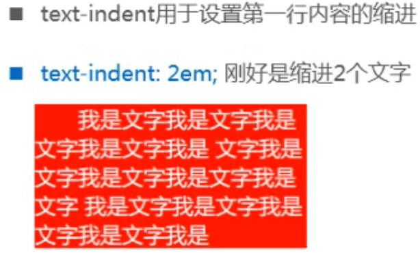
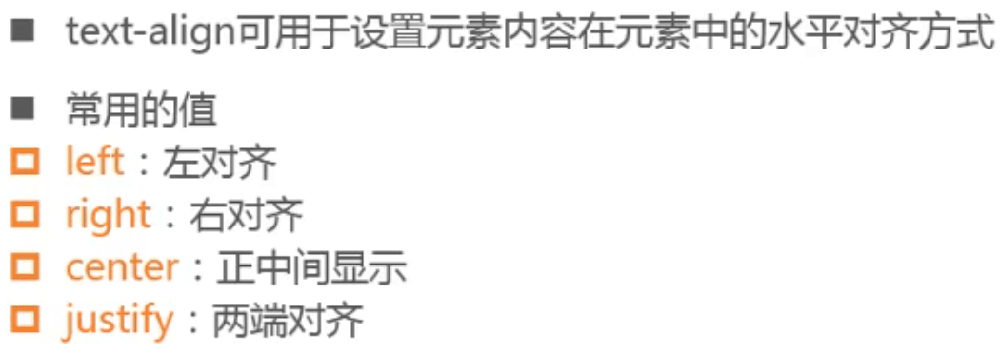

## CSS属性

### text-decoration

- 查看浏览器默认样式

### letter-spacing、word-spacing

- letter-spacing、 word-spacing分别用于设置字母、 单词之间的间距
  - 默认是0，可以设置为负数
  - 浏览器默认将连在一起的看作一个单词，用空格分开的为多个单词。

### text-transform

### text-indent

- em是相对于fontsize文字大小计算的，2em正好是两个字的宽度。

### text-align

- 有些元素，宽度默认是占据整个父元素，比如div、p、h1~h6 等
- 有些元素，宽度默认是包裹内容，宽度等于内容的总宽度，比如span、 strong、a