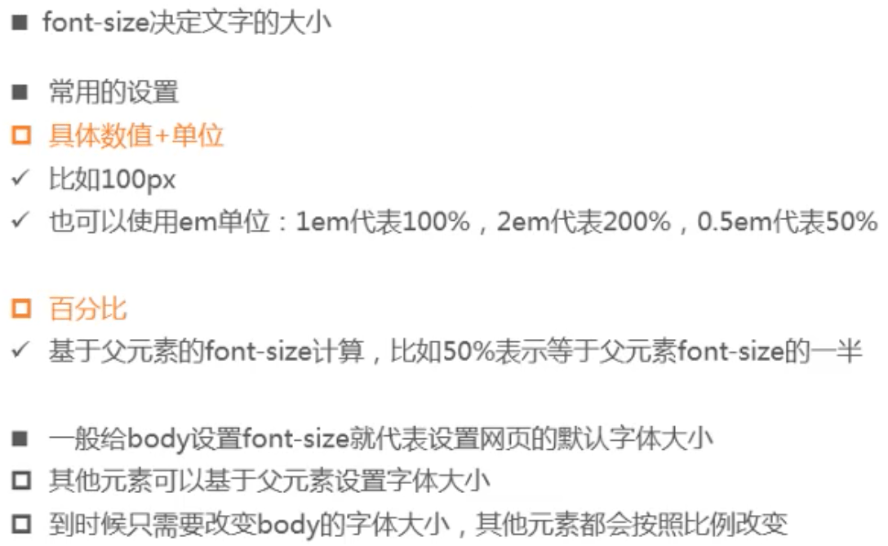
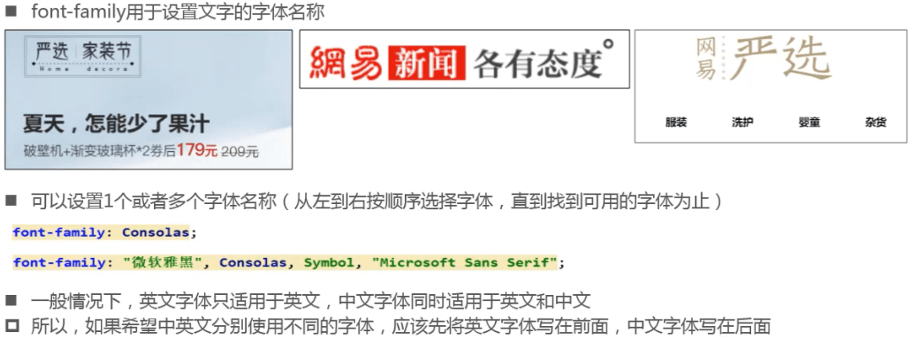
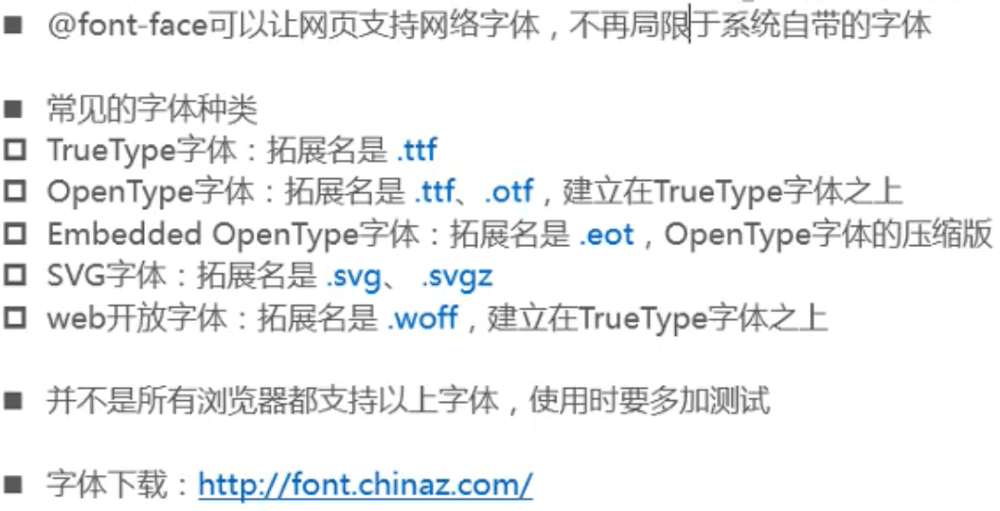
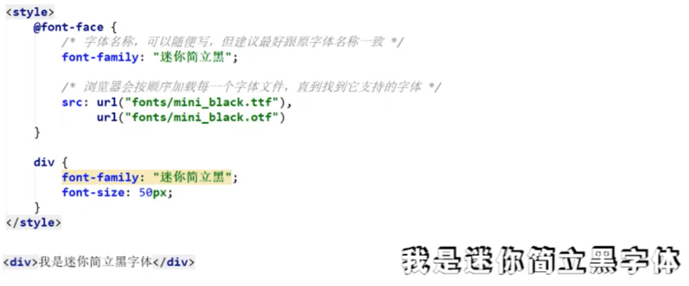
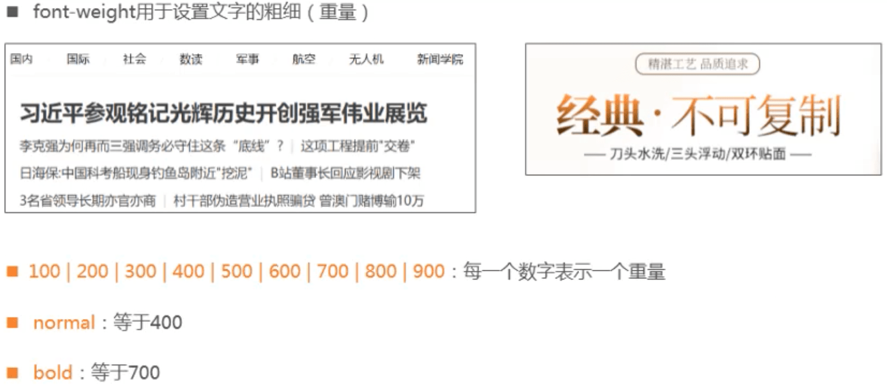
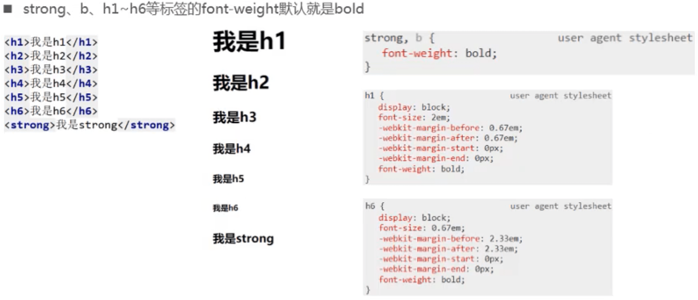
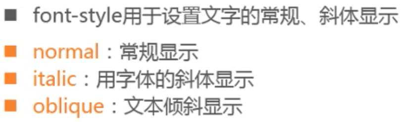
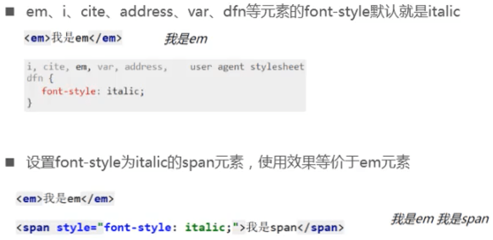
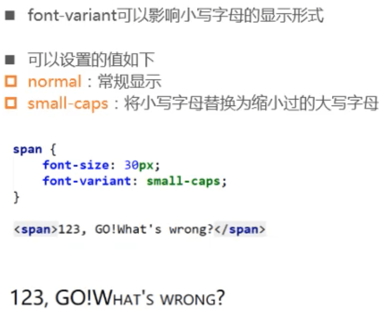

## Font

### font-size

- 如果给一个标签的font-size设置为em、百分比，都是相对于父元素font-size而言。

### font-family

### @font-face

### font-weight

### font-style

- 字体可能没有斜体，设置为italic可能无效，oblique直接将文本倾斜。

### font-variant

