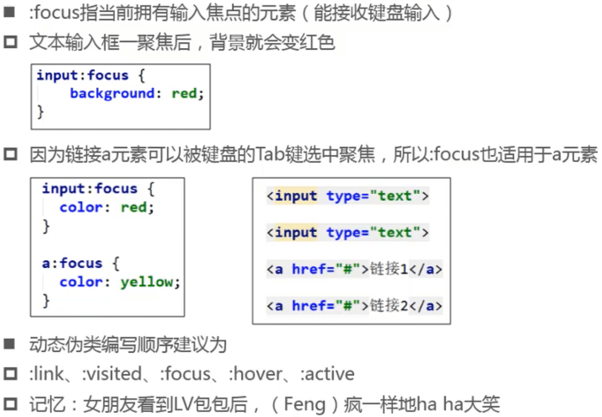
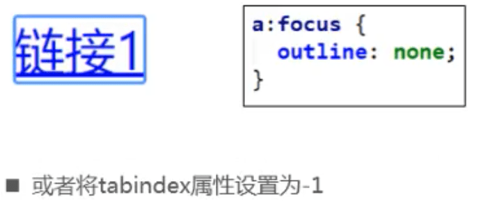

## css选择器（selector）

### 元素选择器（type selectors）

### 通用选择器（universal selectors）

### id选择器（id selectors）

#### id注意点

- 一个HTML文档里面的id值是唯一的，不能重复
- id值如果由多个单词组成，单词之间可以用中划线（-）、下划线（_）连接,也可以使用驼峰标识，（建议用中划线）
- 最好不要用标签名作为id值
- 不能有空格

- 中划线又叫连字符（hyphen）

### 类选择器（class selectors）

#### class注意点

- 多余的空格（开头，类名之间，结尾都有多个空格）不影响功能，但还是要按照规范，类名之间加一个空格，首尾不加空格。

### 练习

- 多个类显示效果和类的顺序无关，一般把最主要的放在前面，如果类中有重复的属性，顺序会影响显示效果

### 属性选择器（atdtribute selectors）

####  [attr]

#### [attr=val]

- 建议用双引号

#### [attr~=val]

#### [attr|=val]

#### [attr^=val]

#### [attr$=val]

#### [attr*=val]

## 组合

### 后代组合选择器( descendant combinator )

### 子组合选择器( child combinators )

- 组合中可以放任意选择器
- 后代组合和子组合可以混用

- 包括间接元素

- 不包括间接元素

### 相邻兄弟组合选择器( adjacent sibling combinator )

### 全体兄弟组合选择器( general sibling combinator )

## 选择器组

 ### 交集选择器

- 注：div元素和类.one直接挨在一起

### 并集选择器

### 交集和并集对比

### 练习

## 伪类（pseudo-classes）

### 动态伪类（dynamic pseudo-classes）

#### :fouce

#### 去除a元素默认的:focus效果

#### tabindex属性

- 使用tabindex可以控制tab键选中元素的顺序，从1开始
- tabindex设置为-1 ，代表禁止使用tab键选中

#### 细节

### 目标伪类 ( target pseudo-classes )

### 

### 元素状态伪类( UI element states pseudo-classes )

### 语言伪类( language pseudo-classes )

### 结构伪类（structural pseudo-classes ）

#### :nth-child( )

- :nth-child(n)，n是具体数组则选择第n个元素，直接填n选择所有

- 4个一组

#### :nth-last-child()

#### 思考

#### :nth-of-type( )， :nth-last-of-type( )

#### empty

### 否定伪类

- 否定伪类建议和元素标签一起使用。避免把html、body等修改了

## 伪元素（pseudo-elements）

### ::first-line

### ::first-letter

### ::before和::after

### attr()

