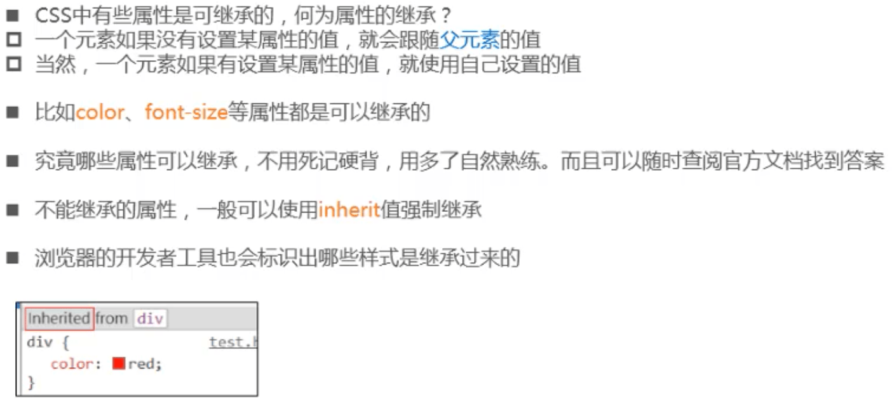
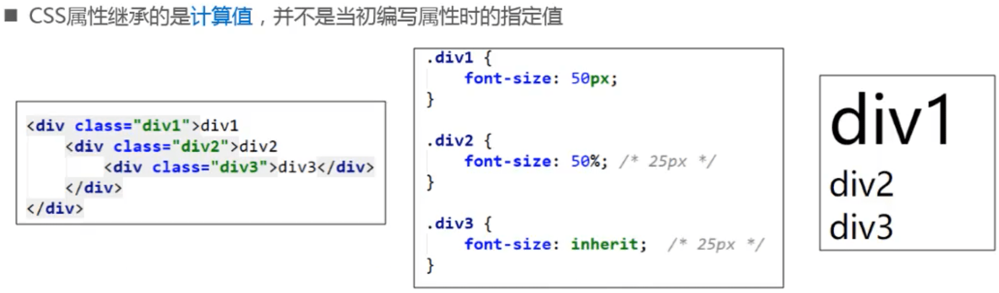
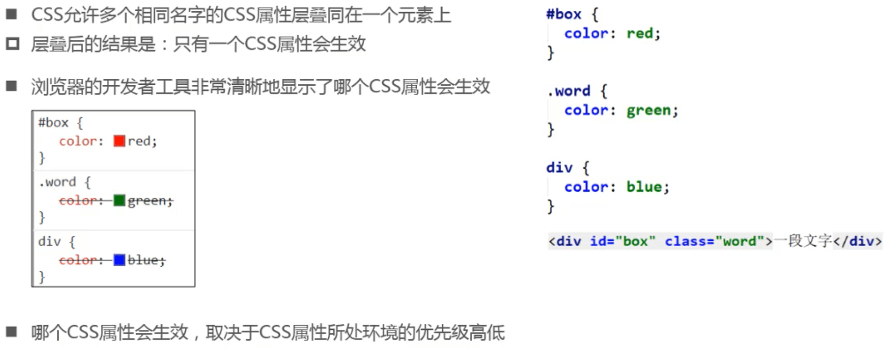
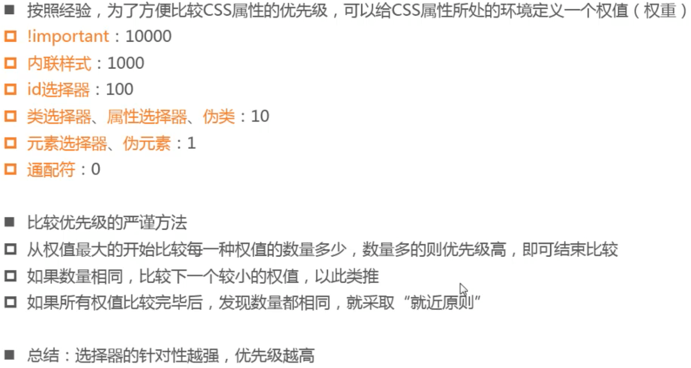
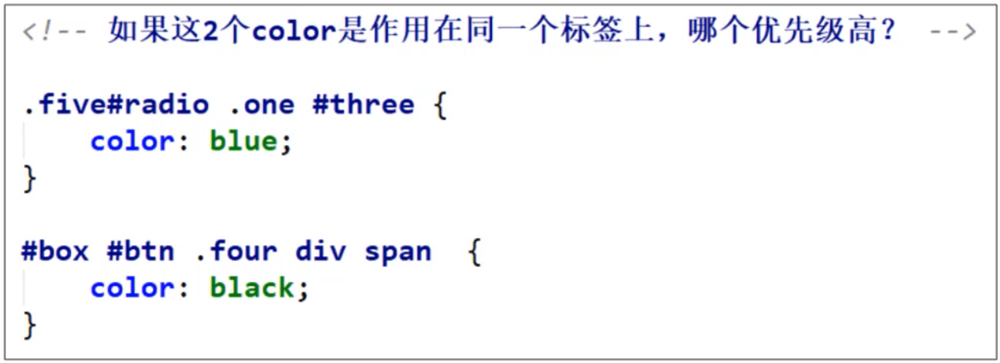
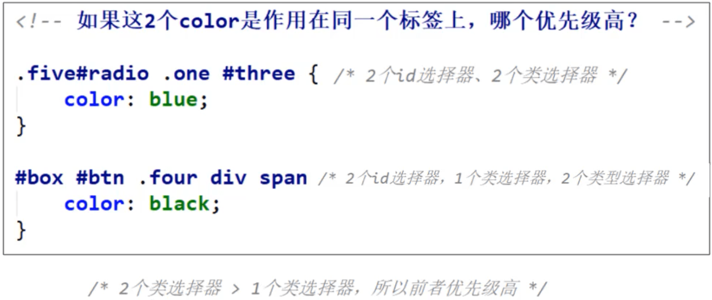
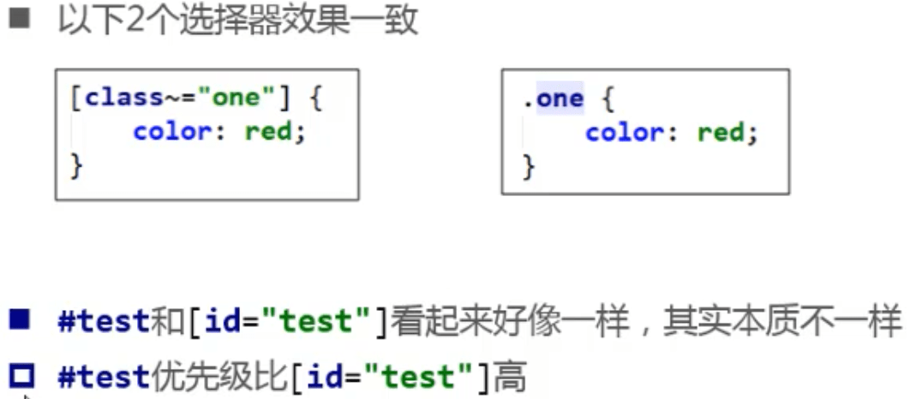
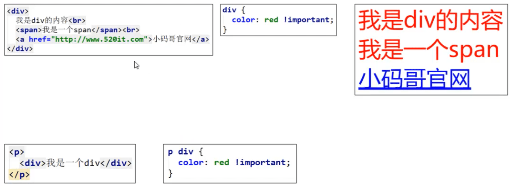
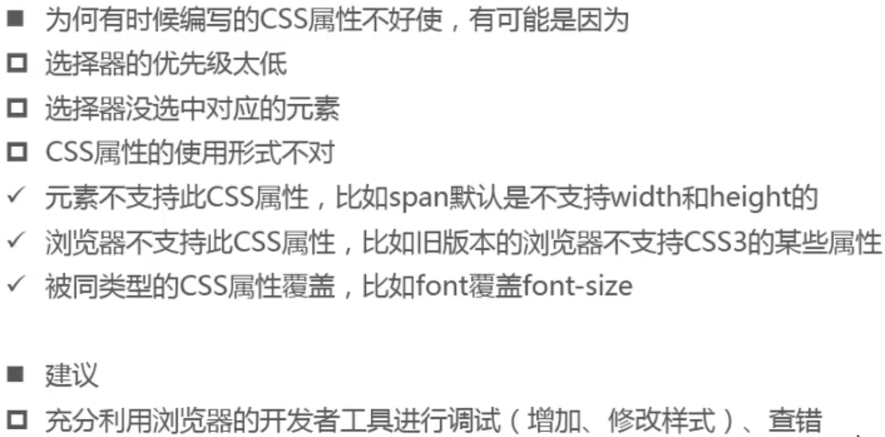

## CSS特性

### CSS属性的继承

### 继承的注意点

- 50%叫做字面值或指定值，25px叫做计算值

### CSS属性的层叠

### CCS属性的优先级

#### 小细节

#### 思考：为什么会出现以下结果

- a元素有默认样式，不会从父元素继承，chrome检查->html->Styles中可以看到
- p元素不能嵌套div元素，chrome会将

转成

，平级关系无法继承属性。chrome显示源码可以看到代码

### CSS属性使用经验

