## 元素类型

### 块级、行内级元素

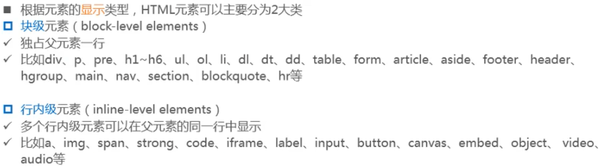

- 独占是指，即使后面有空间，紧跟的元素也会换行显示。 

### 替换、非替换元素

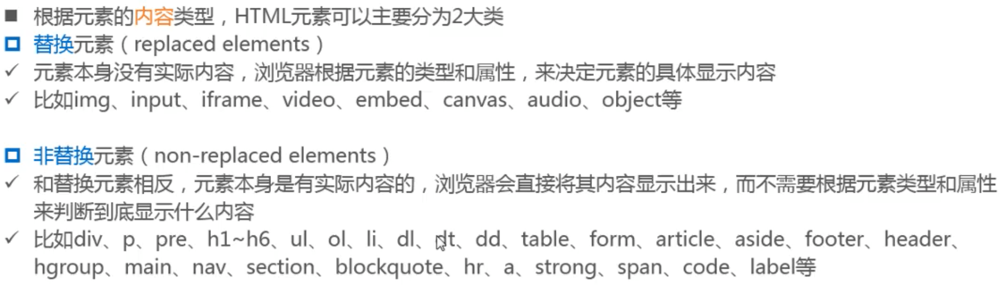

### 元素分类总结

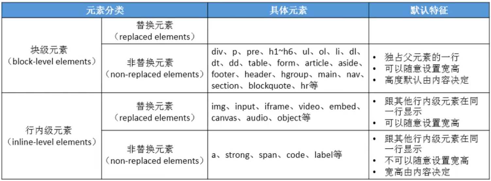

## display

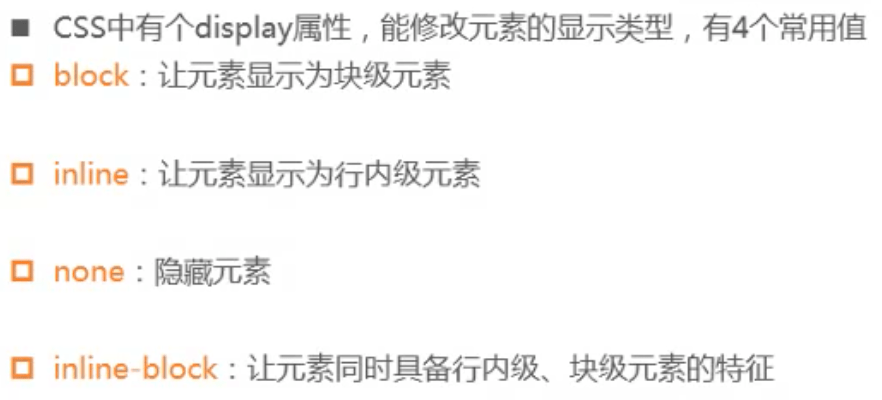

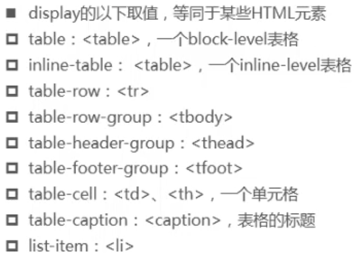

### inline-block

- 可以让元素同时具备块级、 行内级元素的特征
  - 跟其他行内级元素在同一行显示
  - 可以随意设置宽高
  - 宽高默认由内容决定
- 可以理解为
  - 对外来说，它是一个行内级元素
  - 对内来说，它是一个块级元素

- 常见用途
  - 让行内级非替换元素(比如a、span等 )能够随时设置宽高

## visibility

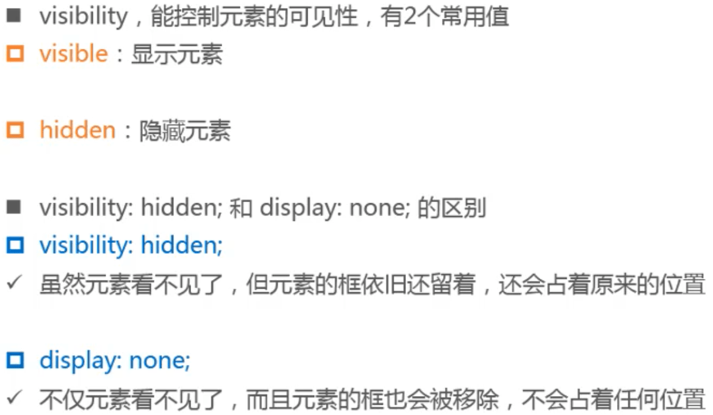

## overflow

- overflow用于控制内容溢出时的行为
  - visible :溢出的内容照样可见
  - hidden :溢出的内容直接裁剪
  - scroll :溢出的内容被裁剪,但可以通过滚动机制查看
    - 会一直显示滚动条区域,滚动条区域占用的空间属于width、height
  - auto :自动根据内容是否溢出来决定是否提供滚动机制
- 还有overflow-x. overflow-y两个属性,可以分别设置水平垂直方向（建议直接使用overflow，overflow-x. overflow-y还没有成为标准，浏览器可能不支持）

## 细节

### 元素之间的空格

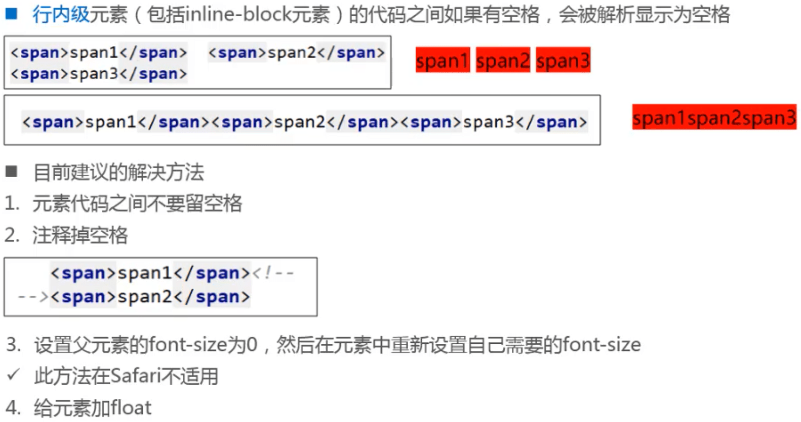

### 注意点

- 块级元素、inline-block元素
  - 一般情况下,可以包含其他任何元素(比如块级元素、行内级元素、inline -block元素)
  - 特殊情况, p元素不能包含其他块级元素
- 行内级元素(比如a、span, strong等 )
  - 一般情况下,只能包含行内级元素

- 通过检查，查看源码格式是否正确

## line-height

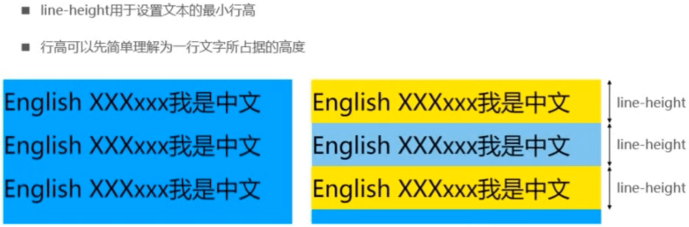

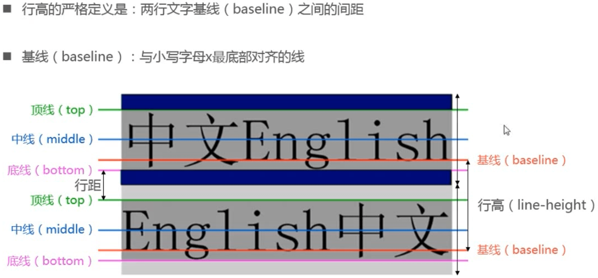

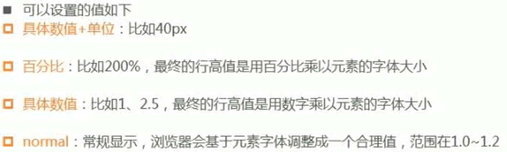

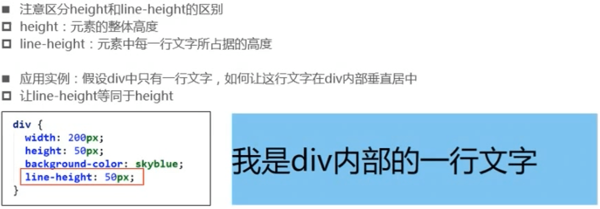

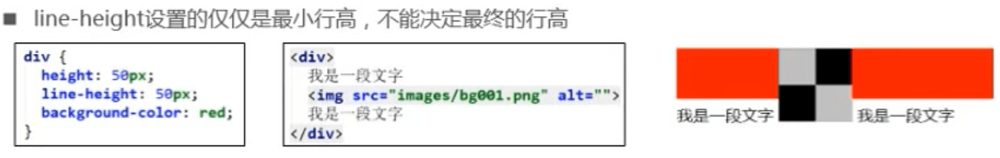

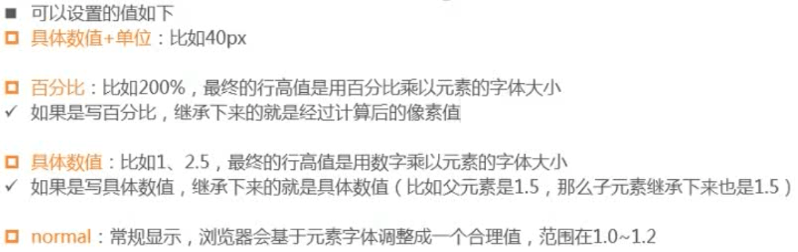

## font

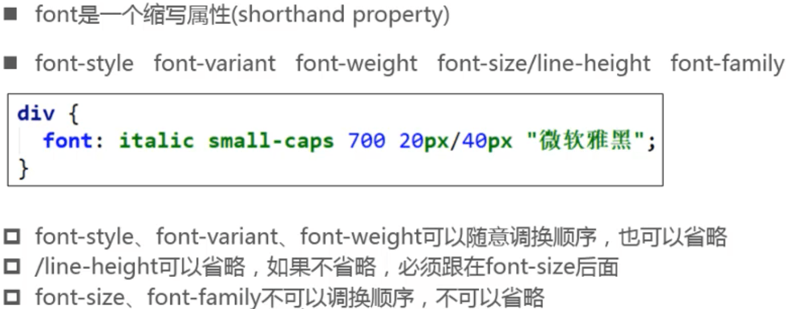

