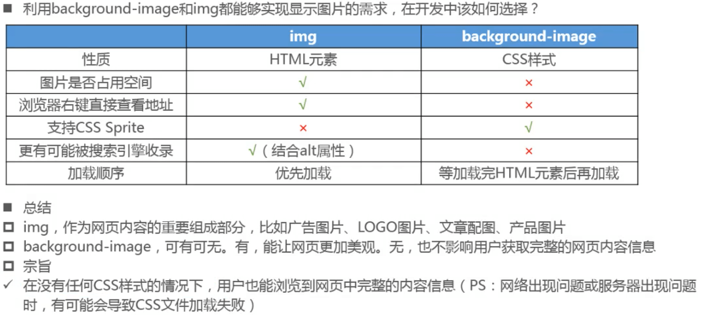

### 背景

### background-image

- 默认不会改变图片大小

### background-repeat

- 圆角带渐变色的button，可以切成三部分，左右圆角分别在两端，中间用宽一个像素，高度为图片高度的图片（线）平铺

### background-size

- background-size用于设置背景图片的大小

### background-position

- background-position用于设置背景图片在水平、 垂直方向，上的具体位置

- 水平方向还可以设值: left、center、right
- 垂直方向还可以设值: top、center、 bottom
- 如果只设置了1个方向，另一个方向默认是center
  - 比如background position: 80px;等价于background -position: 80px center;

### 滑动门技术

- 拼接圆角带渐变效果的圆角按钮，将图片切成三段，左右圆角和中间宽度为一像素，高度为图片高度的线
  - 父元素为div，添加左右圆角图片，设置好padding，在div中添加div，背景图为上面的线并选择平铺。子div要略宽，免得边界穿帮。

### 如何显示一张大图

- 做一张最大屏幕尺寸的图片，在小尺寸屏幕上居中显示。图片两端在小屏幕显示不全，只显示中间最重要的信息
- 设置min-width属性，当屏幕缩小后显示滚动条。这个属性不建议设置成为大图宽度，要不然一打开网站就要滚动

### CSS Sprite

#### CSS Sprite编写建议

### background-attachment

### background

- background是一系列背景相关属性的简写属性 ,常用格式是
  - image position/size repeat attachment color
    - background-size可以省略 ,如果不省略, /background-size必须紧跟在background-position的后面
    - 其他属性也都可以省略,而且顺序任意

### background-image和image的选择

### 特殊元素的背景

- 没有HTML元素对应着文档画布 ,如何设置文档画布的背景?
  - html或者body元素的背景都能够延伸到整个文档画布
  - 如果同时设置了html和body元素的背景,根元素html的背景才会作为文档画布背景
  - 建议通过body元素来设置文档画布背景

#### 伪元素:first-line的背景

#### background实现图片链接

### cursor

