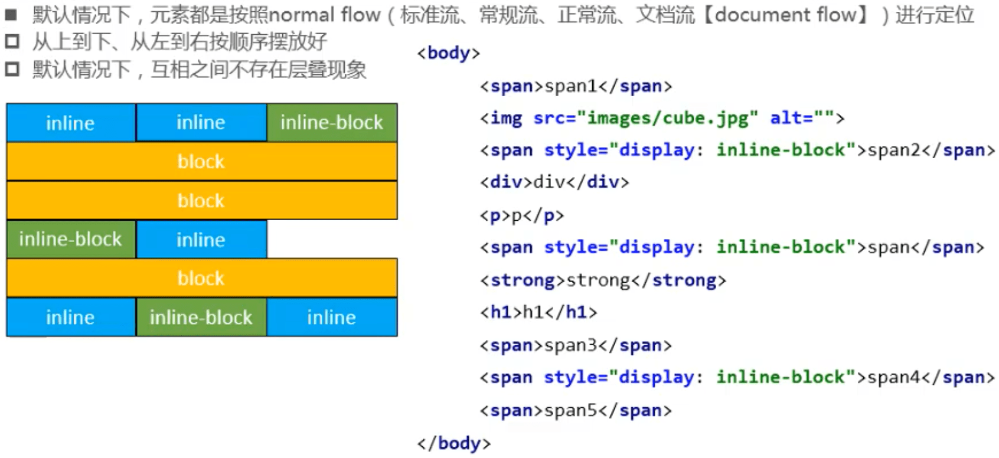
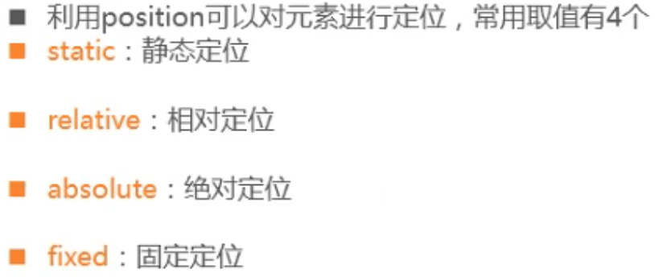
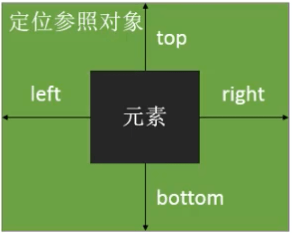
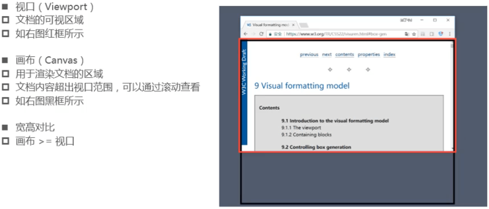
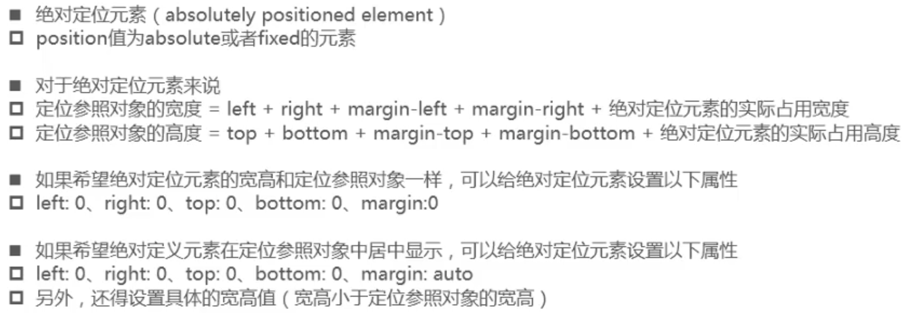
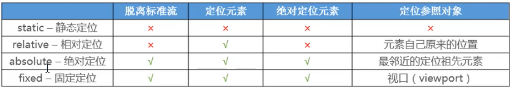
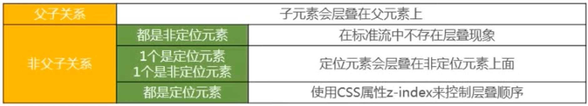
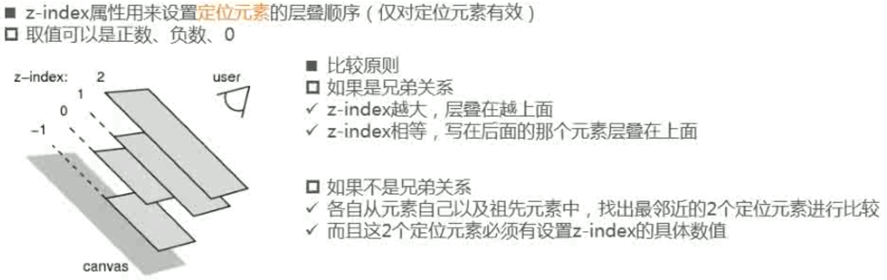

## 定位

### 标准流（Normal Flow）

### margin、padding定位

- 在标准流中,可以使用margin. padding对元索进行定位
  - 其中margin还可以设置负数
- 比较明显的缺点是
  - 设置一个元素的margin或者padding ,通常会影响到标准流中其他元素的定位效果
  - 不便于实现元素层叠的效果

### position

#### relative - 相对定位

- 元素按照normal flow布局
- 可以通过left、right、 top、 bottom进行定位
  - 定位参照对象是元素自己原来的位置
- left、right、 top、 bottom用来设置元素的具体位置,对元素的作用如下图所示

- 相对定位的应用场景
  - 在不影响其他元素位置的前提下，对当前元素位置进行微调

#### static - 静态定位

- position属性的默认值
- 元素按照normal flow布局
- left、right、 top、 bottom没有任何作用

#### fixed - 固定定位

- 元素脱离normal flow (脱离标准流、脱标)
- 可以通过left、 right、 top、 bottom进行定位
  - 定位参照对象是视口( viewport)，可以简单理解为浏览器窗口
- 当画布滚动时，固定不动

#### 画布和视口

#### absolute -绝对定位

- 元素脱离normal flow (脱离标准流、脱标)
- 可以通过left、 right、 top、 bottom进行定位
  - 定位参照对象是最邻近的定位祖先元素
  - 如果找不到这样的祖先元素，参照对象是视口
- 定位元素 ( positioned element )
  - position值不为static的元素
  - 也就是position值为relative、 absolute、 fixed的元素

#### 绝对定位技巧

#### 子绝父相

- 在绝大数情况下，子元素的绝对定位都是需要相对于父元素进行定位
- 如果希望子元素相对于父元素进行定位,又不希望父元素脱标,常用解决方案是:
  - 父元素设置position: relative
  - 子元素设置position: absolute
  - 简称为"子绝父相”

#### position总结

**定位元素**：可以设置left，right，top，bottom

**绝对定位元素**：脱标，可以设置在任意位置。

#### 脱标元素的特点

- 可以随意设置宽高
- 宽高默认由内容决定
- 不再受标准流的约束
  - 不再严格按照从上到下、从左到右排布
  - 不再严格区分块级、行内级，块级、行内级的很多特性都会消失
- 不再给父元素汇报宽高数据
- 脱标元素内部默认还是按照标准流布局

### z-index

#### 元素的层叠

#### z-index

