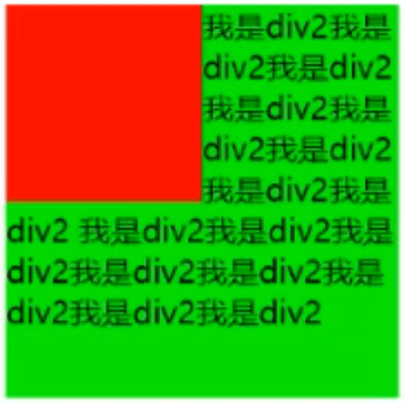
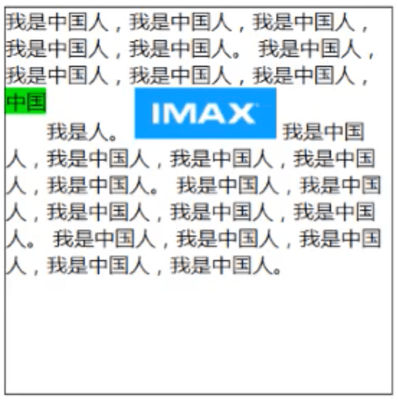
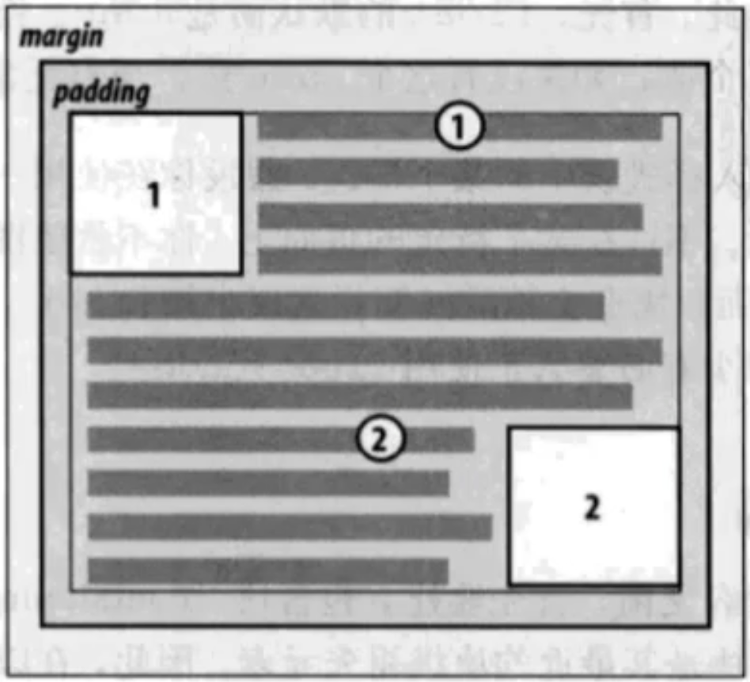
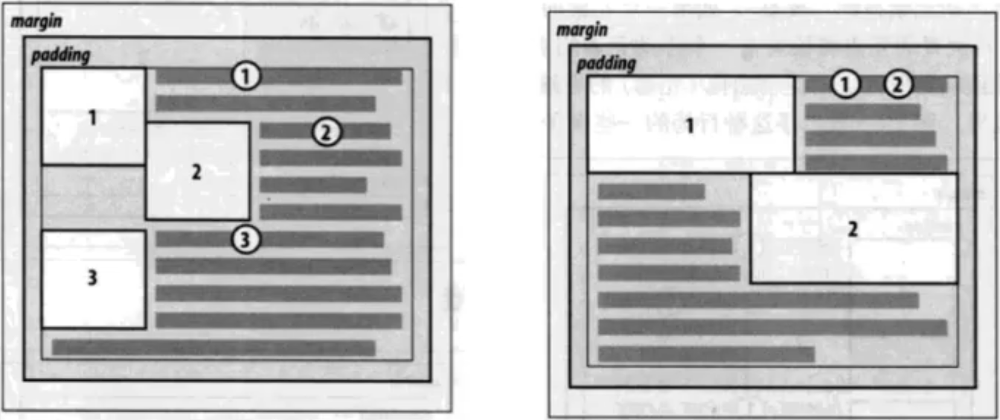
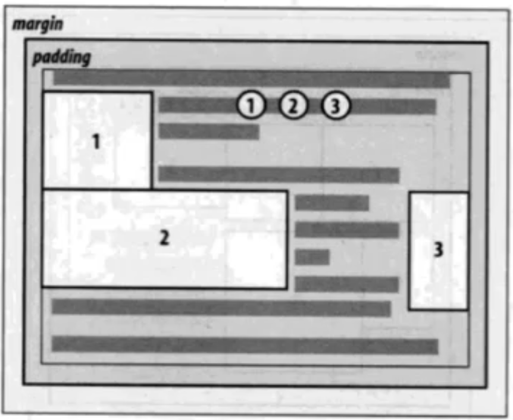
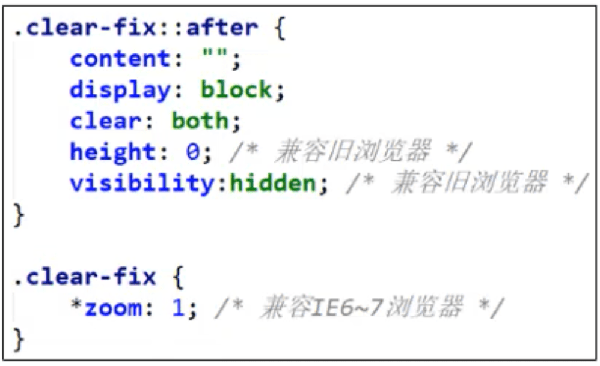
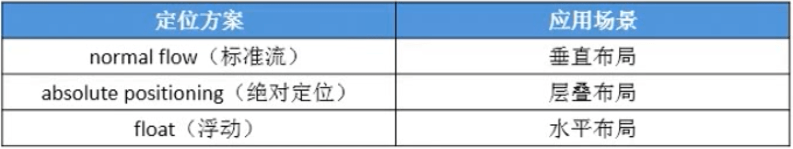

## 定位方案（Position Schemes）

- 在CSS中 ,有3种常用的方法对元素进行定位、布局
  - normal flow :标准流、常规流、文档流
  - absolute positioning :绝对定位
  - float :浮动
- 绝对定位、 浮动都会让元素脱离标准流，以达到灵活布局的效果

## float

- 可以通过float属性让元素产生浮动效果 , float的常用取值
  - none:不浮动,默认值
  - left :向左浮动
  - right :向右浮动

### 浮动规则

- 元素一旦浮动后
  - 脱离标准流
  - 朝着向左或向右方向移动，直到自己的边界紧贴着包含块(一般是父元素)或者其他浮动元素的边界为止
- 定位元素会层叠在浮动元素上面

- 浮动元素不能与行内级内容层叠,行内级内容将会被浮动元素推出
  - 比如行内级元素、inline-block元素

- 利用此特性,可以轻松实现文字环绕功能

- 行内级元素、inline_block元素浮动后，其顶部将与所在行的顶部对齐

- 如果元素是向左(右)浮动,浮动元素的左(右)边界不能超出包含块的左(右)边界（带圆圈的数字，标记着浮动元素浮动之前的位置）

- 浮动元素之间不能层叠
  - 如果一个元素浮动,另一个浮动元素已经在那个位置了,后浮动的元素将紧贴着前一个浮动元素（左浮找左浮，右浮找右浮）
  - 如果水平方向剩余的空间不够显示浮动元素,浮动元素将向下移动,直到有充足的空间为止

- 浮动元素的顶端不能超过包含块的顶端,也不能超过之前所有浮动元素的顶端

### 浮动的问题

- 由于浮动元素脱离了标准流，变成了脱标元素,所以不再向父元素汇报高度
- 导致了父元素高度坍塌的问题
- 解决父元素高度坍塌问题的过程，一般叫做清浮动 (清理浮动)

### 清浮动

#### 清浮动的常见方法

- 给父元素设置固定高度
  - 扩展性不好(不推荐)
- 让父元素浮动
  - 可能导致页面中所有元素都浮动
  - 父元索脱离了标准流(不推荐)
- 让父元素成为绝对定位元素( position设置为absolute或fixed )
  - 父元索脱离了标准流
  - 改变了元素的盒子特性(不推荐)
- 给父元素设置 display为inline-block. inline-table. table、 table-cell. table-caption
  - 改变了父元素的盒子特性(不推荐)
- 给父元素设 置overflow为visible以外的值(比如hidden. auto、 scroll )
  - 改变了父元素对内容溢出的默认行为(不推荐)
- 在父元素最后增加一个空的块级子元素，并且让它设置clear: both
  - 会增加很多无意义的空标签，维护麻烦
  - 违反了结构与样式分离的原则(不推荐)
- 在父元素最后增加一个br标签： 
  - 会增加很多无意义的空标签,维护麻烦
  - 违反了结构与样式分离的原则(不推荐)
- 给父元素增加::after伪元素
  - 纯CSS样式解决,结构与样式分离(推荐)

## clear

- clear的常用取值
  - left :要求元素的顶部低于之前生成的所有左浮动元素的底部
  - right :要求元素的顶部低于之前生成的所有右浮动元素的底部
  - both :要求元素的顶部低于之前生成的所有浮动元素的底部
  - none :默认值,无特殊要求
- 一般就只用在非浮动元素上，可以让非浮动元素与浮动元素不层叠

## 定位方案对比

