## CSS属性

### CSS属性的描述

- CSS官方文档中对每 一个CSS属性都有详细的描述

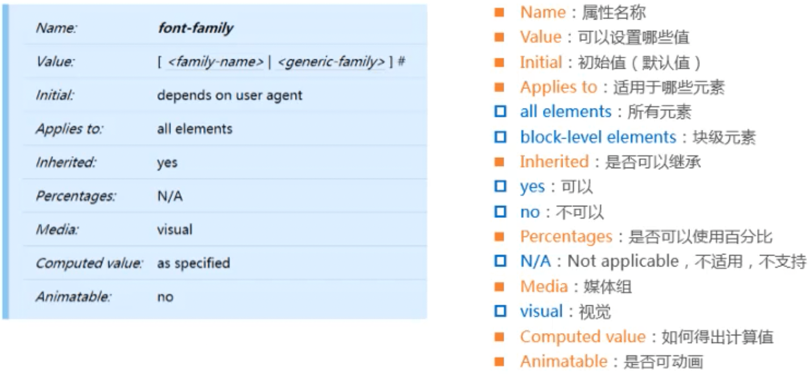

### CSS属性的取值 - 组合(combinators)

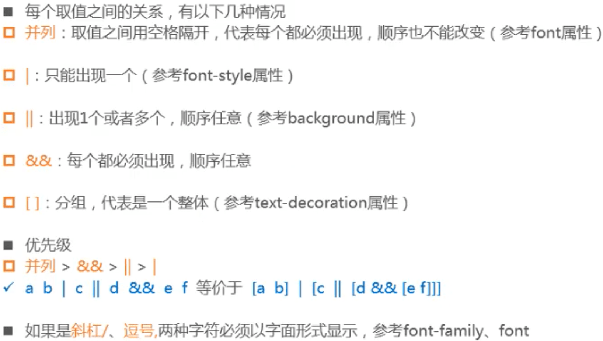

### CSS属性的取值 - 出现次数( multipliers )

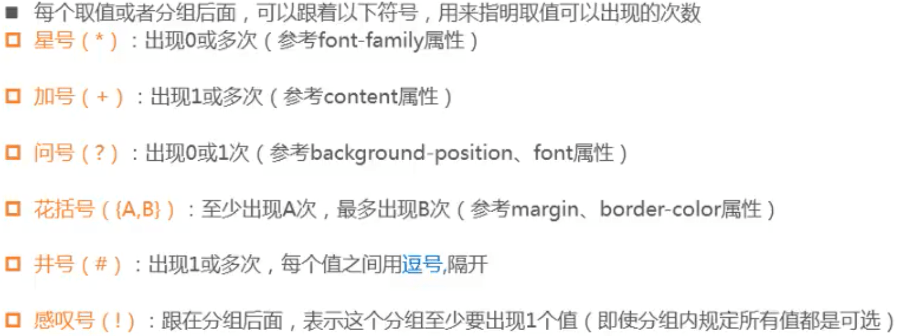

### 举例

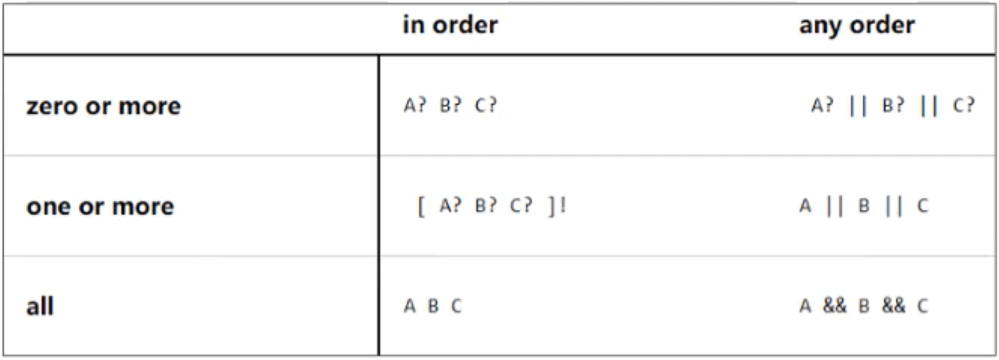

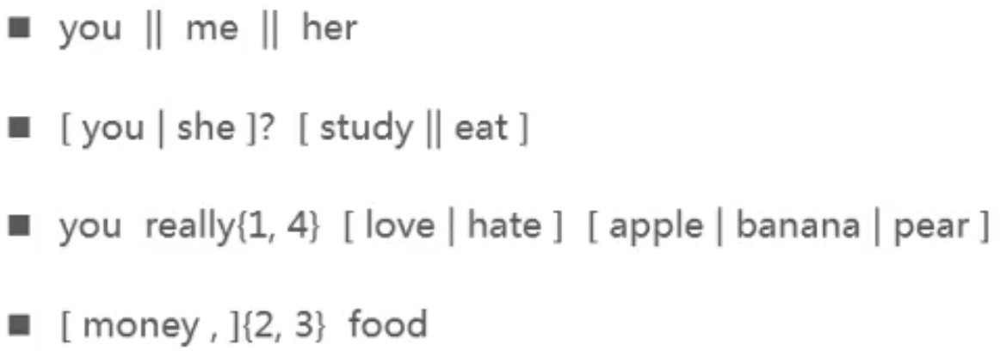

### CSS属性的取值 - 类型( types )

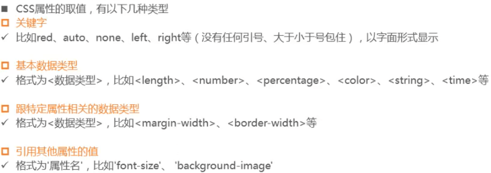

### 举例

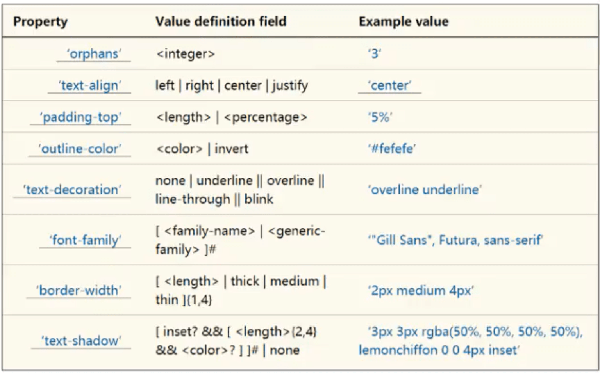

### \<number\>，\< integer\>

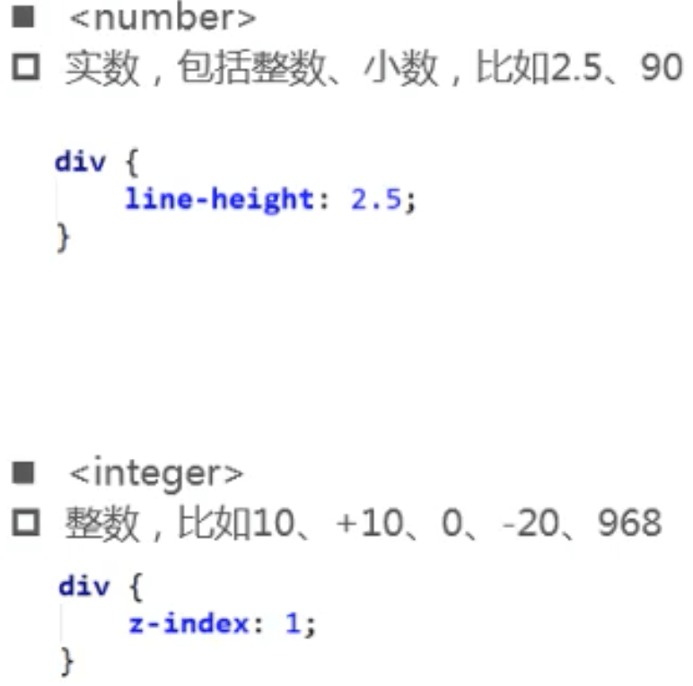

### \<length\>

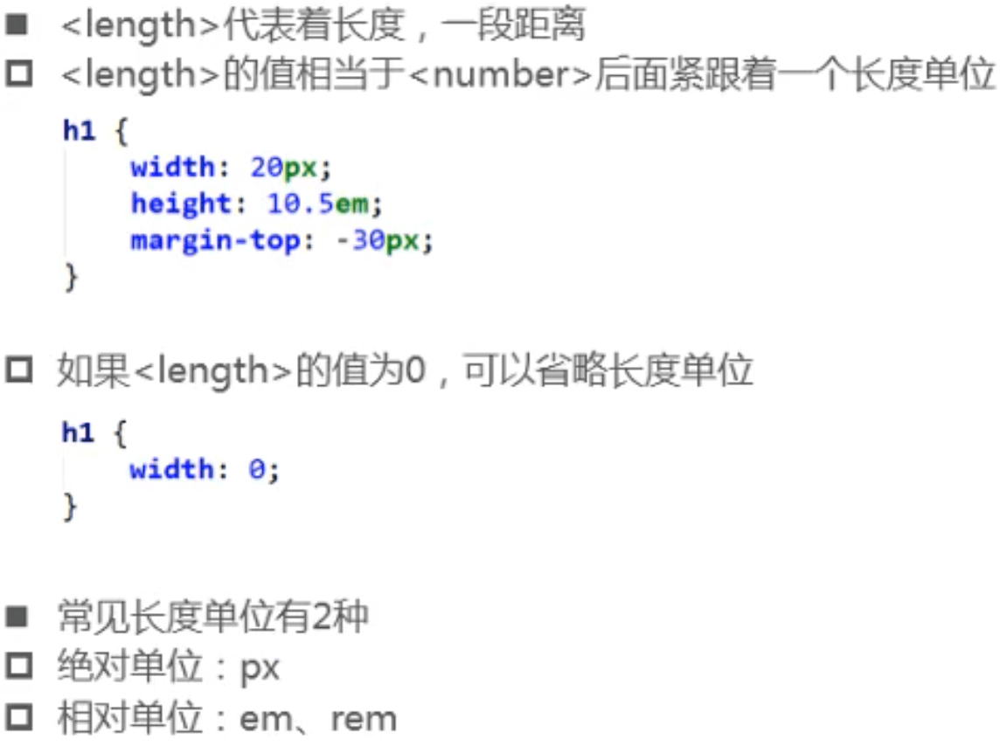

### \<time\>

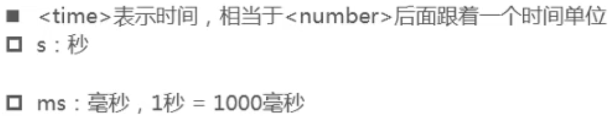

### \<angle\>

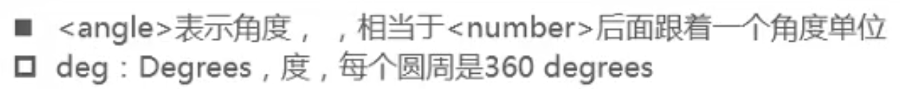

### \<percentage\>

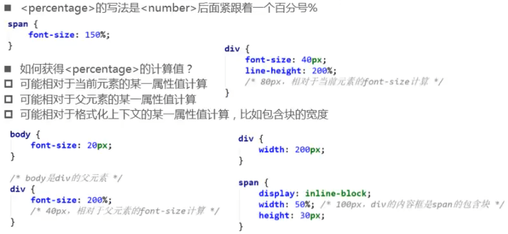

### \<string\>

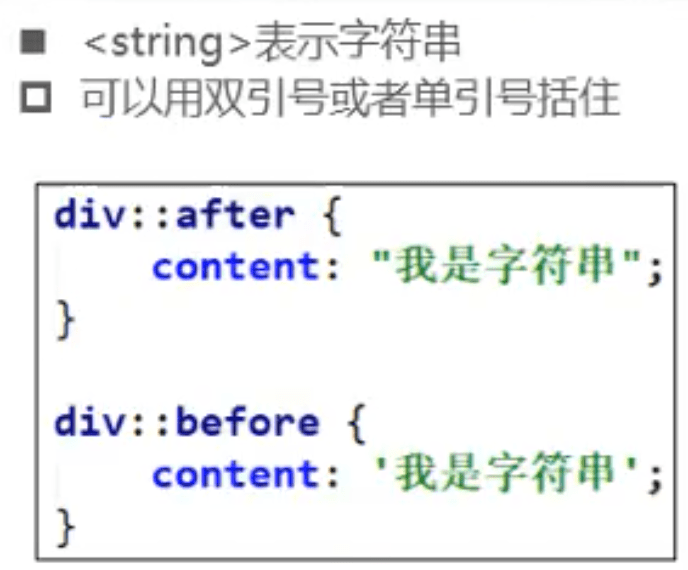

### \<url\>

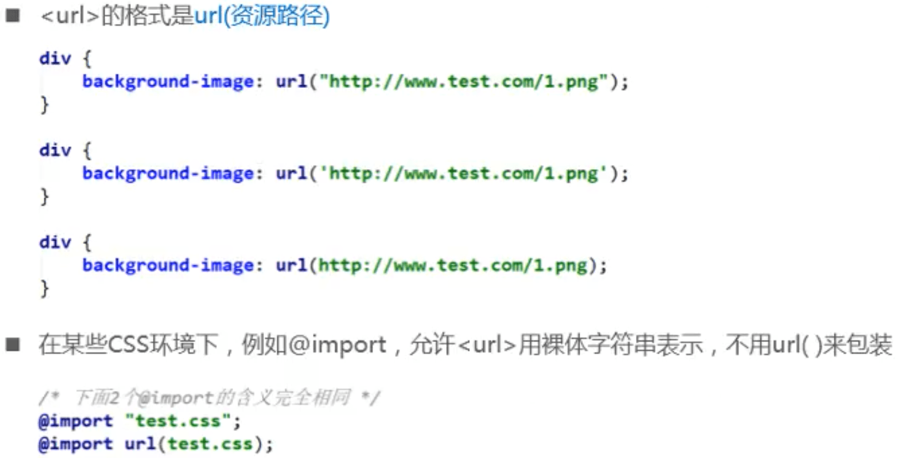