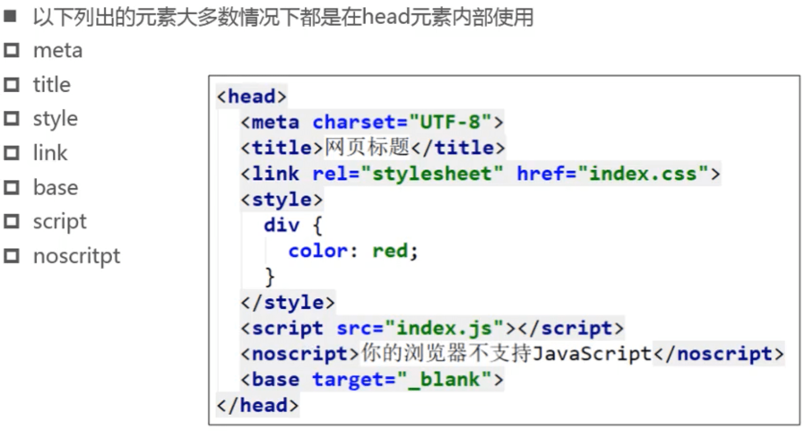

## HTML文件

- HTML文件的拓展名是.htm\\.html
  - 因历史遗留问题, Win95\Win98系统的文件拓展名不能超过3字符,所以使用.htm
  - 现在都是使用.html

- 一般我们也可以称HTML文件为网页文件

- 什么是HTML ?
  - HTML用来描述网页的内容和结构,由浏览器负责解析HTML转换成具体的图文界面
  - 比如浏览器会将左边的HTML代码转换成右边的网页界面

- HTML 的全称是Hyper Text Markup Language ,超文本标记语言

### 为什么叫超文本标记语言

### 常用元素

### 元素书写格式

### 元素嵌套元素

### 元素的属性

### 注释

### HTML简史

### 观察不同网页的HTML代码，有什么共同点?

### 文档声明

### html元素

### head元素

### body元素

### 练习

- 1行没有文档声明
- 3行UTF-9没有此编码
- 7行末缺少</h2>
- 17行末缺少</li>
- 20行多余

- 21、25行嵌套错误，将21行改成
<strong>或者改25行

### HTML5官方文档

### 常用网站

#### HTML

- 国内参考手册
  - http://www.w3school.com.cn
  - https://www.w3cschool.cn/html/dict
  - http://www.runoob.com/tags/html-reference.html
- 国外参考手册
  - https://www.quackit.com/html/tags/
  - https://developer.mozilla.org/zh-CN/
- 官方
  - https://www.w3.org/TR/2017/REC-html51-20171003/
  - https://www.w3.org/standards/techs/html

#### CSS

- 国内参考手册
  - http://css.doyoe.com/
  - http://www.runoob.com/cssref/css-reference.html
- 国外参考手册
  - https://tympanus.net/codrops/css_reference/
  - http://cssreference.io/
  - https://www.quackit.com/css/reference/
- 官方
  - https://www.w3.org/TR/2011/REC-CSS2-20110607/
  - https://www.w3.org/standards/techs/css
