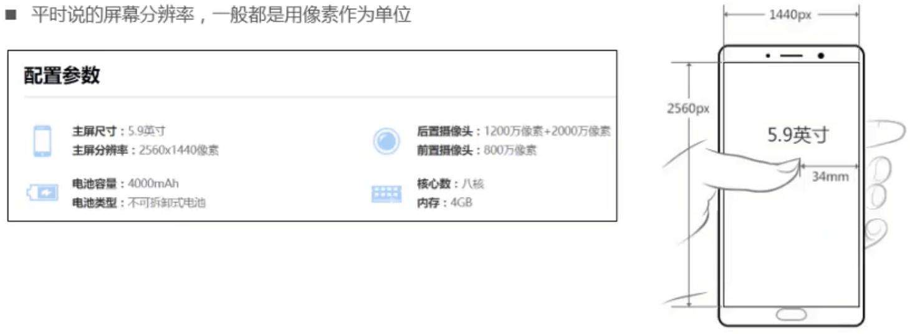

## h、p、strong元素

- h
  - 表示网页的标题
  - h1~h6共规定了6个等级的标题
- p元素
  - 表示文章中的一个段落( paragraph )
- strong元素
  - 用于强调某些文本，粗体的显示效果

## h元素和SEO

- h元素有助于网站的SEO ( Search Engine Optimization )优化,可以促进关键词排名
- 建议在网页中最多只有1个h1元素
- 乱用h元素不仅不会给网站带来好的权重 ,同时也有可能被搜索引擎认为作弊,最后导致K站

## pre元素

- 在默认情况下 , HTML代码中的大多数空格都会被浏览器压缩，比如一段连续的空格会被压缩成1个空格
- 如果想完全保留HTML代码中的空格、 换行，可以使用pre元素

## 字符实体( Character Entity )


```html
&lt;div&gt;

网页上显示:
<div>
```

## 练习

- 显示提示信息

```
<p title="这是一个段落">我是p元素</p>
```

- 同时显示单双引号

```html
<div title="这是一个&aquot;特殊&aquot;的块，非常&apos;精彩&apos;">这是一个div</div>
```

## code、br元素

- code元素
  - 用于显示程序代码
- br元素
  - 单标签，表示强制换行

## img元素


- 注意
  - img元素如果只设置了width (或height) ,浏览器会自动根据图片宽高比计算出height (或width )
  - 在HTML5规范中, alt是img元素的必要属性

### 常用的图片格式

- web中常用的图片格式有
  - png:静态图片,支持透明
  - jpg :静态图片,不支持透明
  - gif: 动态图片、静态图片,支持透明

### 像素

- 像素(px) 是图像显示的最小单位
- 每个像素都能表示一种颜色
- 计算机显示出来的图像都是由一堆像素组成的
- 组成图片的像素越多，显示越清晰




## a元素


### target


- \_parent、\_top和页面嵌套(iframe)相关
- target的值必须是name属性的值（id不行）

## iframe元素


## base元素


  

注：不建议将<base href="http://www.baidu.com" target="_blank">分开写成<base href="http://www.baidu.com">和<base target="_blank">两个

## 锚点链接


- \<a href="#">回到顶部\</a> 只写一个#默认跳转到顶部

- 大部分标签只能通过id定位，只有a标签可以通过name定位

## 伪链接

- 有时候点击链接的时候并不希望打开新的URL，而是希望干点别的事情，这时可以使用伪链接
- 伪链接：没有指明具体链接地址的链接
- 点击链接后具体要做什么事情，需要编写对应的JavaScript代码
- 如果暂时不做任何事,可以先写成下面形式
  - href属性不能为空，免得默认产生未知效果，这种写法看着像是一个锚点链接，不推荐 


- 有时候可以把连接当做按钮使用

## 图片连接


## 思考: a元素一定是用来跳转到新网页的么?

a会根据href的类型进行相关操作，比如下载zip，发邮件，启动迅雷下载等。

## URL


### URL格式


### URL常见协议

- http
  - 超文本传输协议,访问的是远程的网络资源,格式是http://
  -  http协议是在网络开发中最常用的协议
  - https协议相当于是http协议的安全版
- file
  - 访问的是本地计算机上的资源,格式是file:// (不用加主机地址)
- mailto
  - 访问的是电子邮件地址,格式是mailto:
- ftp
  - 访问的是共享主机的文件资源,格式是ftp://

- ed2k
  - 通过支持ed2k (专用下载链接)协议的P2P软件访问该资源(代表软件:电驴) ,格式是ed2k://
- thunder
  - 通过支持thunder (专用下载链接)协议的P2P软件访问该资源(代表软件:迅雷) , 格式是thunder://

### 更具体的URL


## 标签语义化

- 什么是标签语义化?
  - 选择标签的时候要尽量让每一个标签都有正确的语义
- 虽然很多标签之间互换之后也能实现功能，但还是要遵守“标签语义化”的原则
  - 比如用strong（通过设置css，js）去实现a、img的功能
- 标签语义化的好处
  - 方便代码维护
  - 减少让开发者之间的沟通成本
  - 能让语音合成工具正确识别网页元素的用途,以便作出正确的反应
  - 让搜索引擎能够正确识别重要的信息
  - .....
- 总结:使用最合适的标签去做最合适的事情

## span元素

- span元素
  - 默认情况下,跟普通文本几乎没差别
  - 用于区分特殊文本和普通文本，比如用来显示一些关键字

## div元素

- div元素
  - 一般作为其他元素的父容器，把其他元素包住，代表一个整体
  - 用于把网页分割为多个独立的部分


