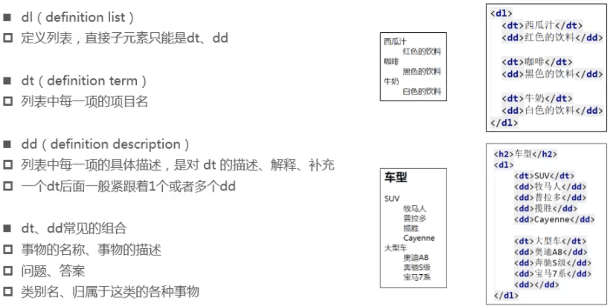
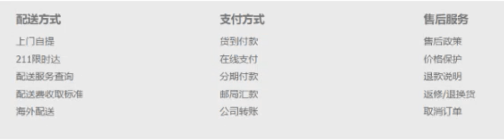
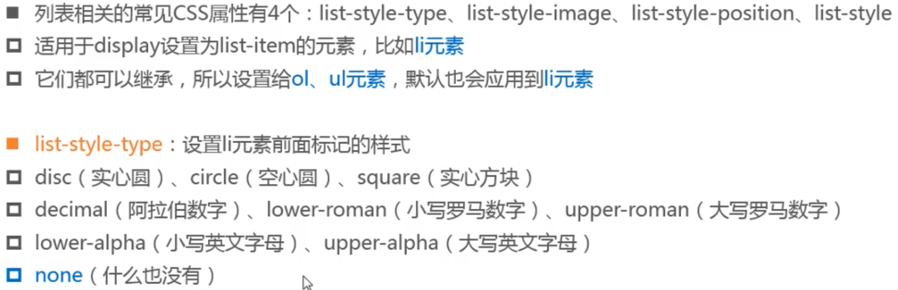
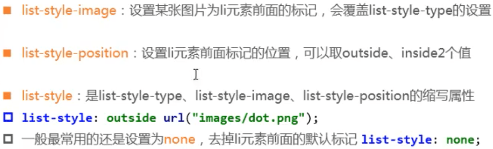

## 列表

- HTML提供 了3组常用的用来展示列表的元素
  - 有序列表: ol、li
  - 无序列表:ul、li
  - 定义列表:dl、dt、dd

### 有序列表（ordered list）

- ol( ordered list )
  - 有序列表，直接子元素只能是li
- li ( list item )
  - 列表中的每一项

### 无序列表：ul、li

- ul ( unordered list )
  - 无序列表，直接子元素只能是li
- li ( list item )

- li一定要是ul或者ol的直接子元素，li中可以嵌套其他元素

### 定义列表：dl、dt、dd

#### 练习

## CSS

### 列表相关的CSS属性

