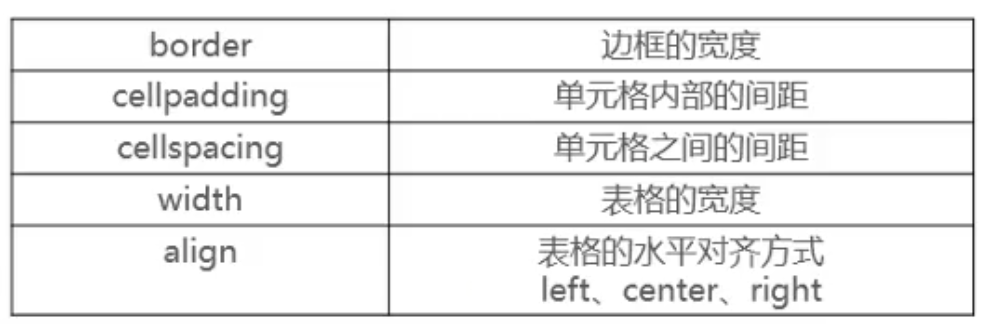
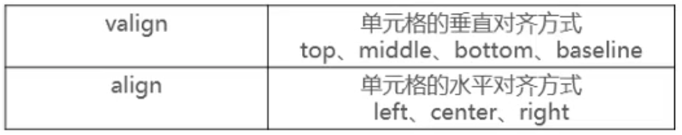
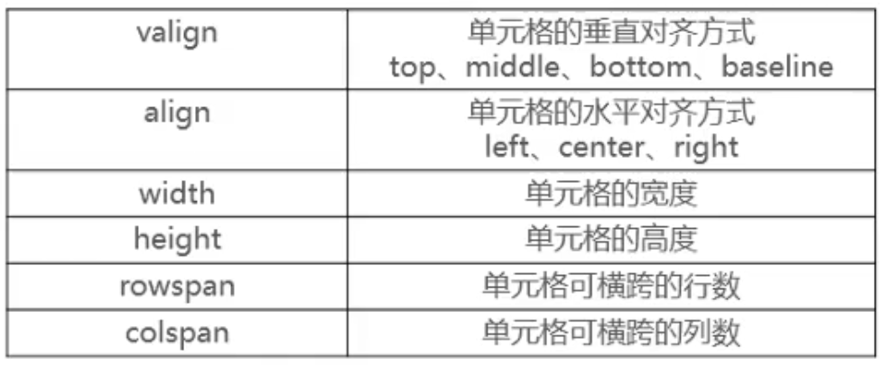
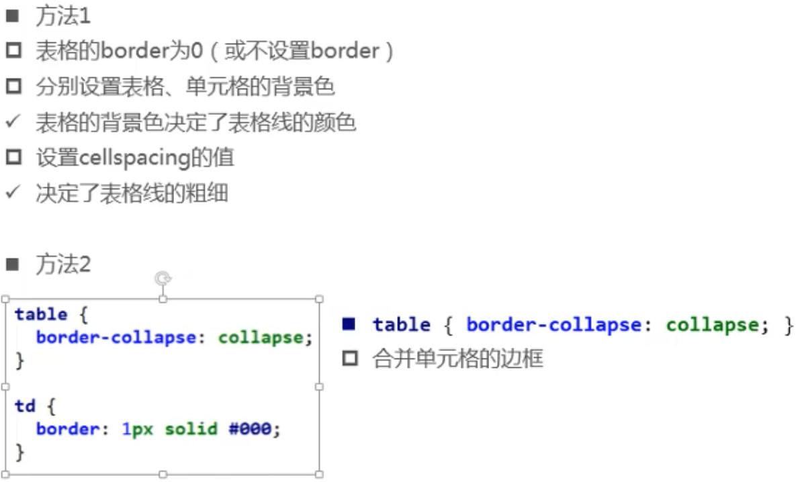
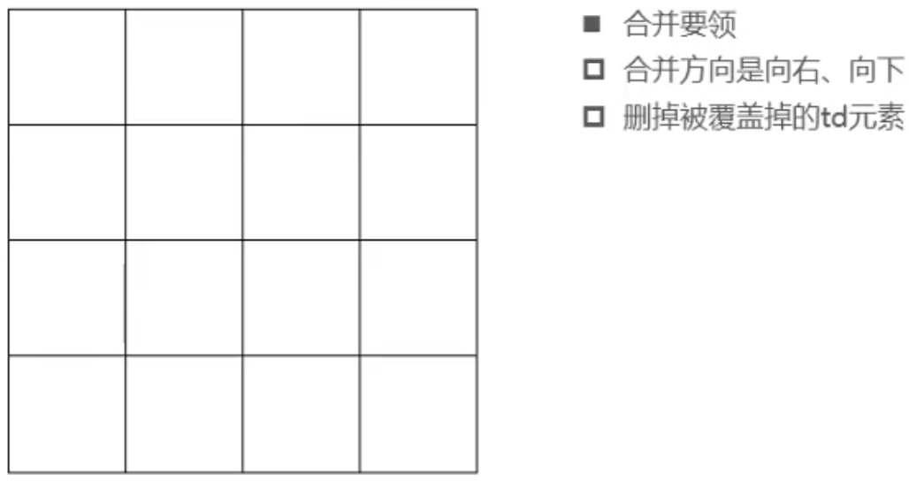
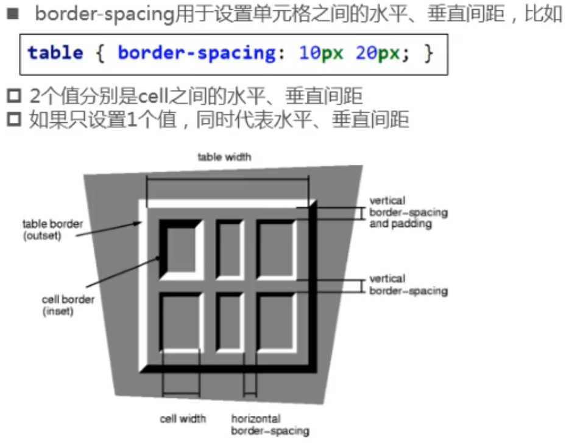

## 表格

### 常用元素

- table
  - 表格
- tr
  - 表格中的行
- td
  - 表格中的列

### table常用属性

### tr常用属性

### th、td常用属性

### 细线表格的实现

### 其他元素

- tbody
  - 表格的主体
- caption
  - 表格的标题
- thead
  - 表格的表头
- tfoot
  - 表格的页脚
- th
  - 表格的表头单元格

### 单元格合并

## CSS

### border-spacing

