## 表单

### 常用元素

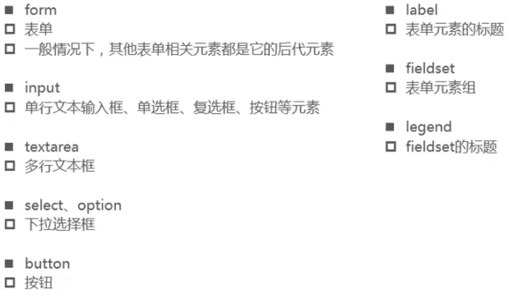

### Input的常用属性

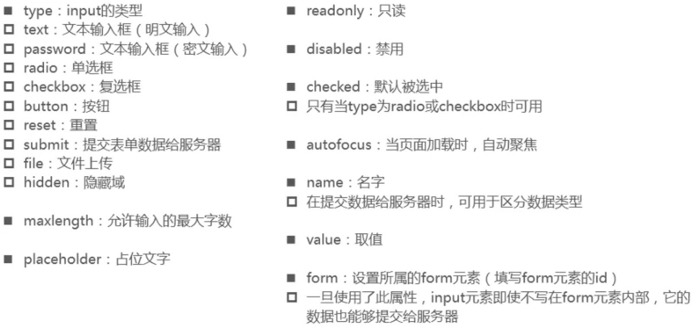

- 同一种类型的radio、checkbox，name属性应该设为一致，才能实现相应功能。

### 布尔属性（boolean attributes）

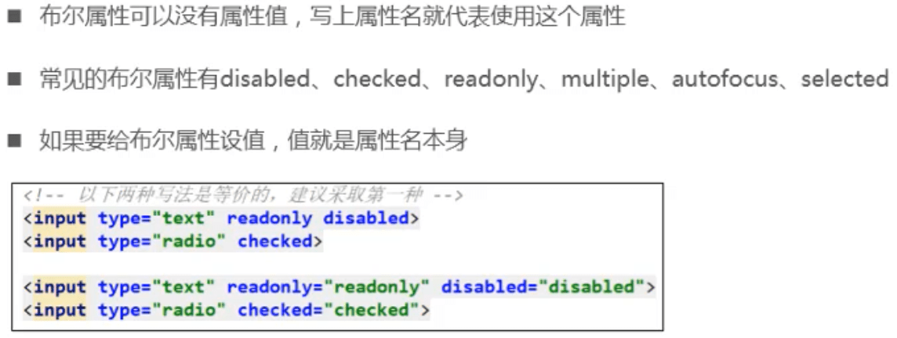

### 按钮

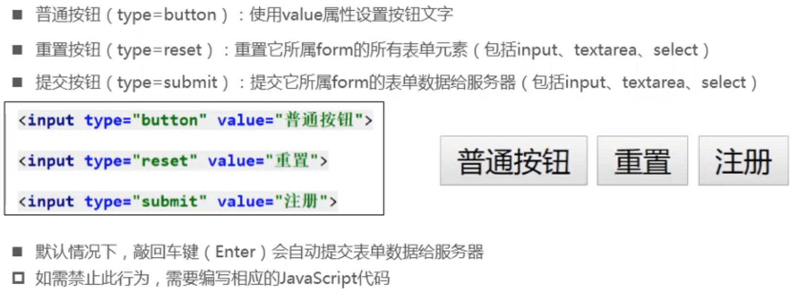

### 去除input的Tab键选中效果

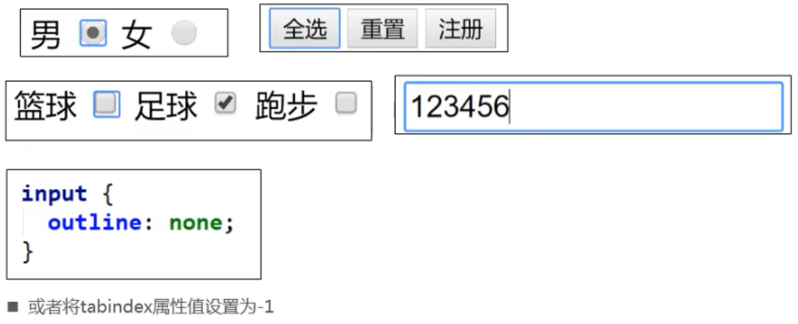

- 通过设置tabindex，可以控制按tab键，input的跳转顺序

### form常用属性

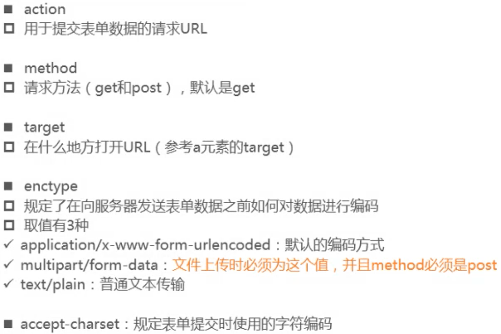

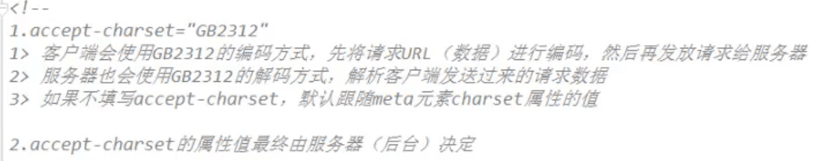

### input、textarea和label

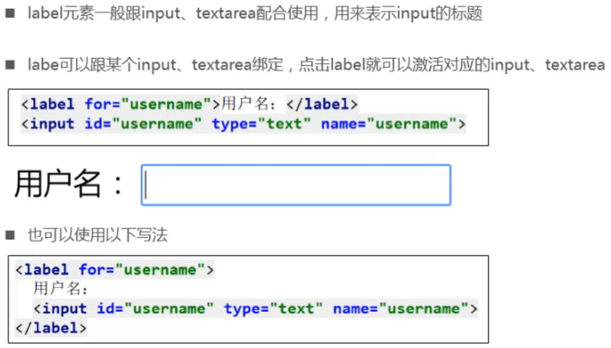

### textarea

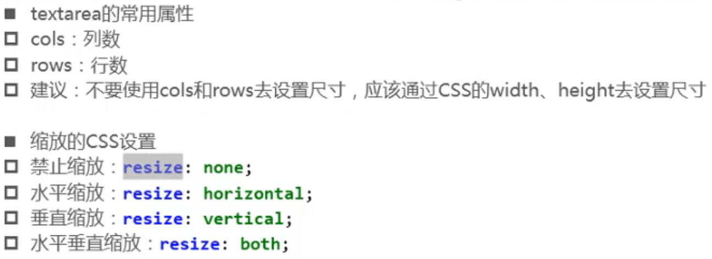

### select和option

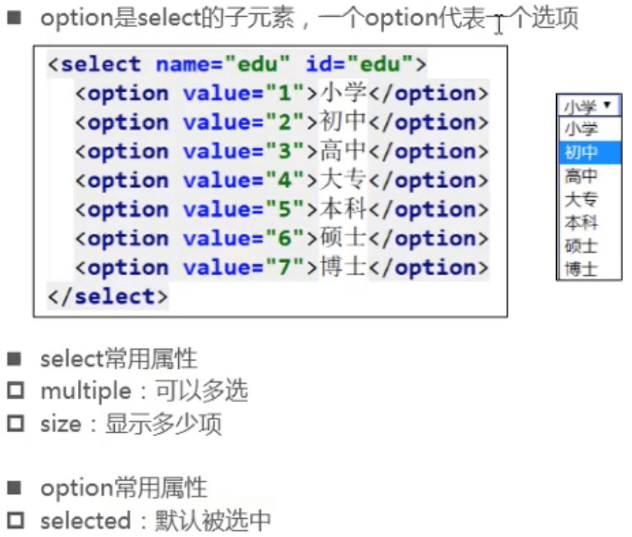

### fieldset和legend

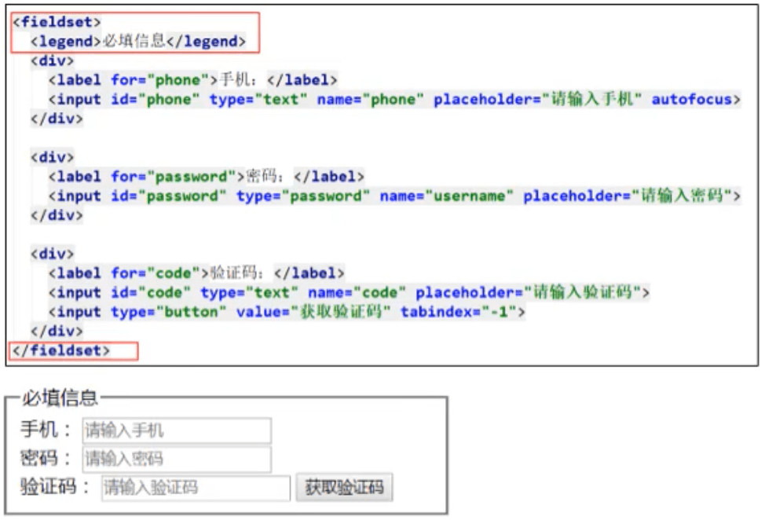

### 隐藏域 ( type=hidden )

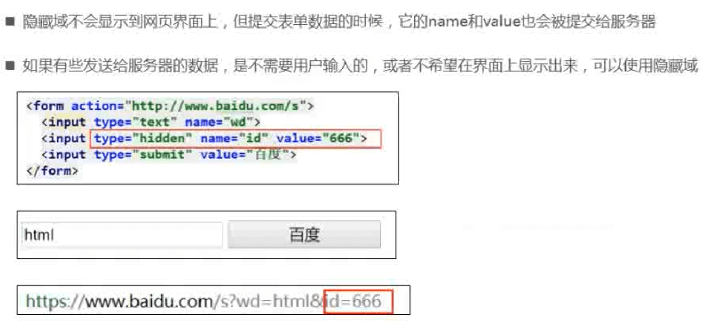