## 插件（plugin）

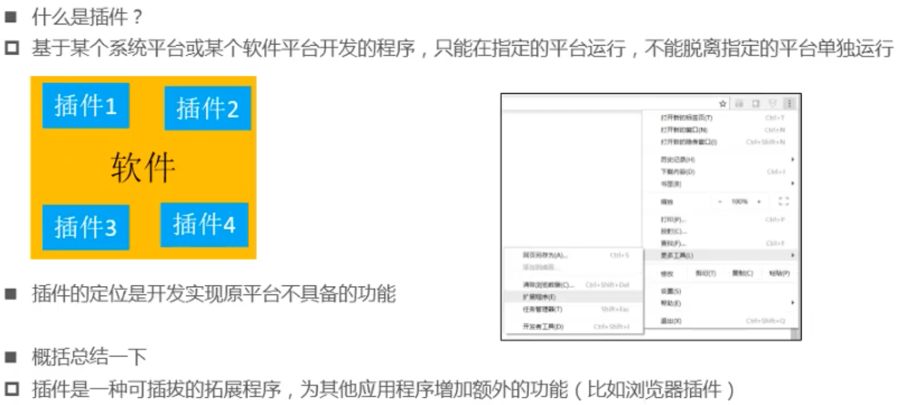

## Emmet插件

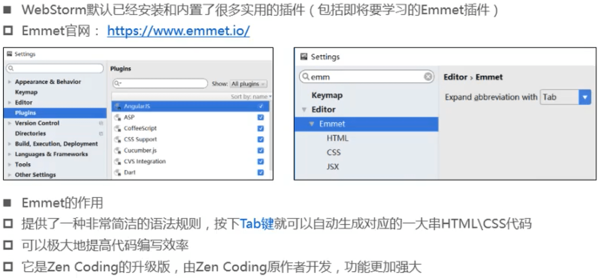

### !和html:5

- !和html:5可以快速生成完整结构的html5代码

### >和+

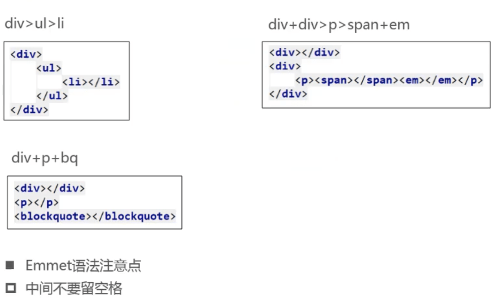

###  *和^

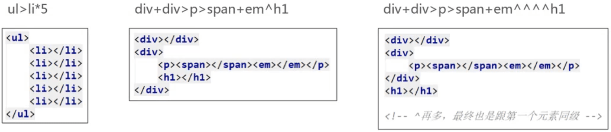

- ^和父元素同级

### ()

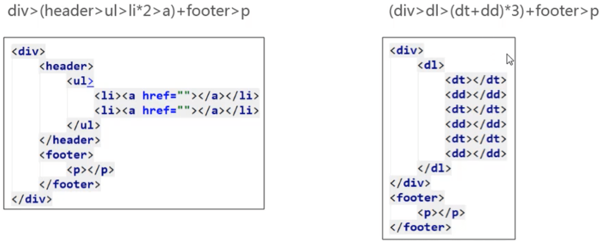

### 属性

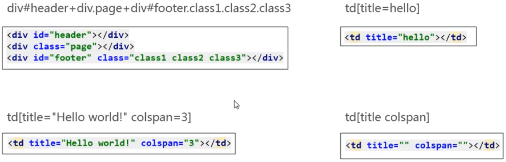

###  $

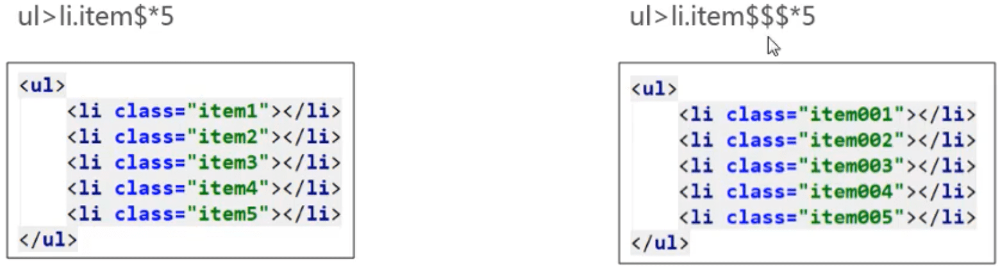

### $@

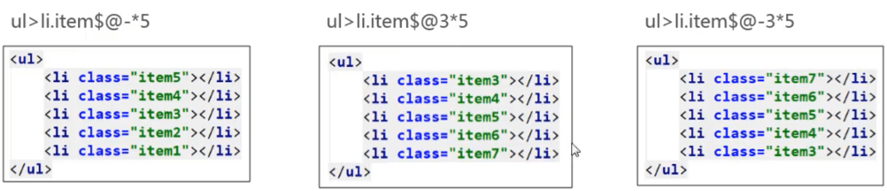

### {}

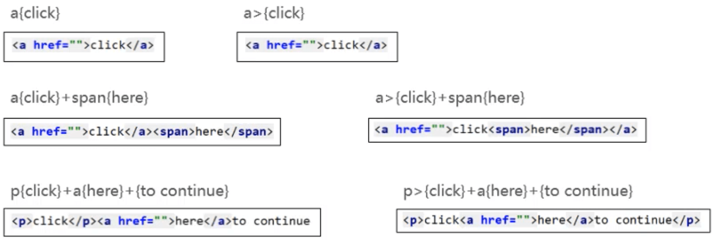

### 隐式标签

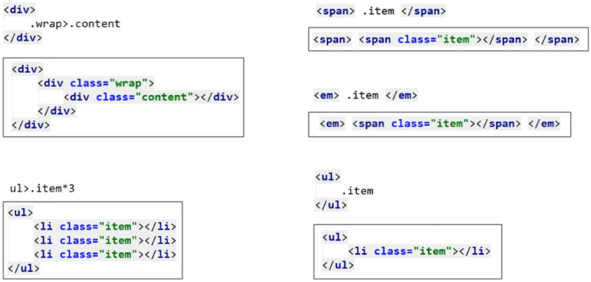

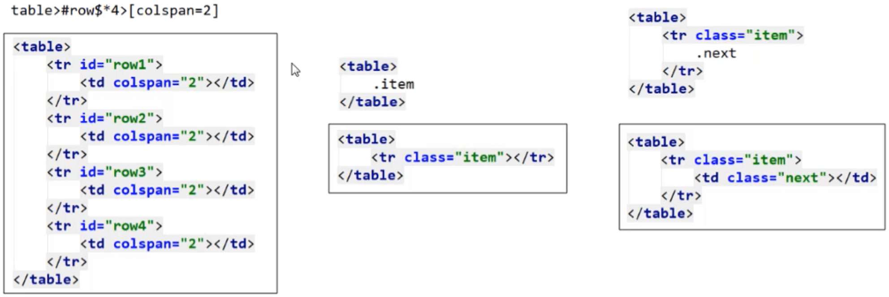

### CSS

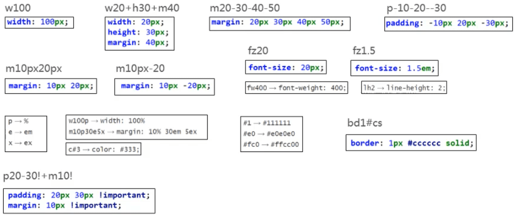

### snippets.json

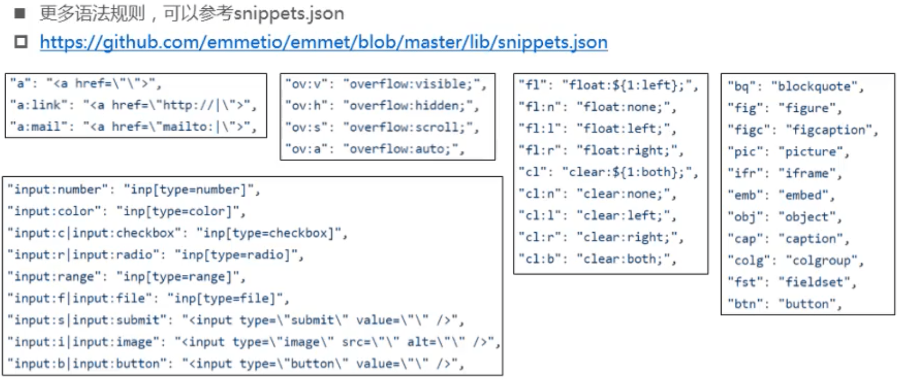

